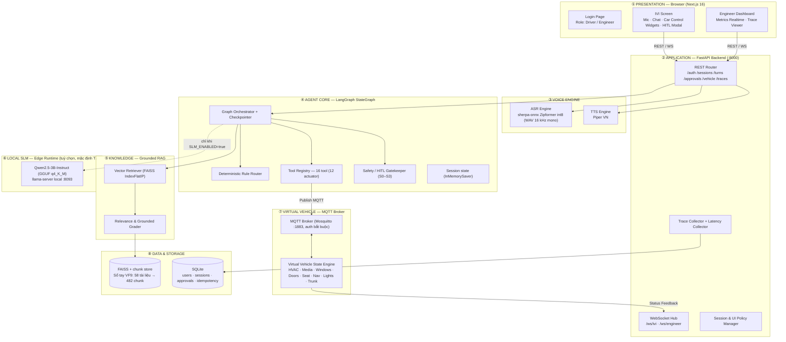
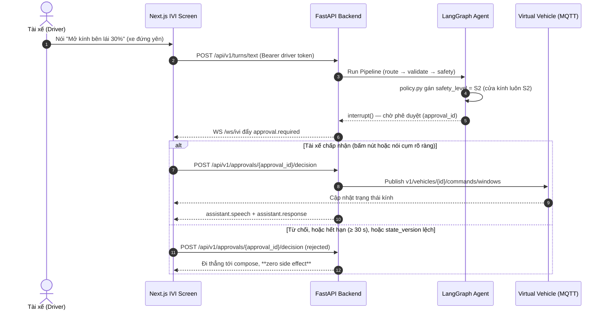

# 🏗️ System Architecture Design Document: VIVI Cabin Copilot

> ⚠️ **TÀI LIỆU TẦM NHÌN SẢN PHẨM (HỌ A) — KHÔNG PHẢI SPEC KỸ THUẬT.**
> Đây là tài liệu ý tưởng & yêu cầu sản phẩm tầng trên (BMAD Product Docs). **Không dùng file này
> làm spec để lập trình.** Khi viết code, dựng API/DB hay tạo Task, tham chiếu bộ **Canonical
> Engineering Specs (Họ B)** trong [`docs/`](docs/):
> [`api_spec.md`](docs/api_spec.md) (nguồn sự thật cho interface và tên tool) ·
> [`safety_and_hitl.md`](docs/safety_and_hitl.md) (nguồn sự thật cho phân loại an toàn) ·
> [`coverage_matrix.md`](docs/coverage_matrix.md) (hệ thống thật sự điều khiển được gì) ·
> [`technical_spec.md`](docs/technical_spec.md) · [`adr/`](docs/adr/).
> Khi file này và `docs/` mâu thuẫn, **`docs/` đúng**.

**Tác giả:** Winston (System Architect)
**Dự án:** VIVI Cabin Copilot — Trợ lý ảo đa phương thức trong xe hơi
**Phiên bản:** 1.1 | **Ngày gốc:** 2026-08-03 | **Đối chiếu lại với code:** 2026-08-26

---

## 1. MỤC TIÊU & NGUYÊN TẮC THIẾT KẾ

### 1.1. Mục tiêu Kiến trúc
Tài liệu định nghĩa kiến trúc kỹ thuật chi tiết cho VIVI Cabin Copilot MVP, cho phép 5 vai trò (AI / Voice / Backend / Frontend / PM) phối hợp làm việc song song mà **không bị nghẽn (block) lẫn nhau** dựa trên các giao ước Interface chuẩn hóa.

### 1.2. 8 Nguyên tắc Thiết kế Cốt lõi (Architecture Principles)

| # | Nguyên tắc | Ý nghĩa & Hệ quả Kiến trúc |
|---|------------|----------------------------|
| **P1** | **Offline-First** | Toàn bộ ASR / SLM / RAG / TTS chạy local 100% tại Edge Gateway. Không gọi cloud, không tự tải model lúc chạy. Mất mạng 4G/5G vẫn vận hành bình thường. |
| **P2** | **Safety-First** | Lệnh nguy hiểm bắt buộc qua HITL Gate. Cổng an toàn nằm ở **Backend**, không phụ thuộc Frontend. |
| **P3** | **Grounded-by-Default** | RAG có ngưỡng similarity (`RAG_MIN_SCORE`); dưới ngưỡng thì **từ chối trả lời**, cấm bịa. Trên ngưỡng thì **trích nguyên văn** đoạn sổ tay kèm citation — composer cố ý **không** diễn giải lại, xem [ADR-015](docs/adr/). |
| **P4** | **Deterministic trước, LLM sau** | Phân loại intent bằng **luật tất định**; đường chạy mặc định **không có LLM nào** (`SLM_ENABLED=false`, ADR-006/ADR-010). Khi bật cờ, SLM chỉ đóng hai vai phụ: đề xuất kế hoạch cho câu luật không khớp, và viết câu mở đầu cho câu trả lời sổ tay (ADR-016). |
| **P5** | **Measurable** | Mọi node trong LangGraph StateGraph đều ghi timestamp, đo độ trễ latency chi tiết từng chặng. |
| **P6** | **Simulation-only** | Không can thiệp CAN Bus thật. Mọi lệnh điều khiển dừng ở Virtual Vehicle Service qua giao thức MQTT. |
| **P7** | **Single Agent, Multi-Node** | Kiến trúc 1 Agent LangGraph quản lý chuỗi Nodes chuyên biệt (tránh overhead độ trễ của Multi-agent). |
| **P8** | **Hands-Free khi xe chạy** | Backend đẩy `ui_policy` xuống IVI để khoá thao tác cảm ứng phức tạp khi xe đang chạy. **Ngưỡng phân loại an toàn không phải `speed > 5 km/h`** — xem §1.3. |

### 1.3. Một ngưỡng đã bị bãi bỏ

Bản 1.0 của tài liệu này (và `docs/VIVI_API_Spec.md`) ghi ngưỡng an toàn `speed > 5 km/h`.
**Ngưỡng đó chưa bao giờ được implement và không được implement.** [ADR-010](docs/adr/ADR-010-canonical-tool-registry-with-product-vision-adapter.md)
thay thế nó, vì nó vừa lỏng hơn mức cần thiết cho cửa kính, vừa nguy hiểm hơn mức cho phép với cửa xe.

Phân loại thật, theo [`docs/safety_and_hitl.md`](docs/safety_and_hitl.md):

- **S0** chỉ đọc · **S1** thực thi sau policy · **S2** bắt buộc HITL · **S3** chặn trước HITL.
- Cửa và vị trí ghế là **S2 chỉ khi `speed_kph == 0 && gear == P`**, ngoài điều kiện đó là **S3**.
- Cửa kính **luôn là S2**, kể cả khi xe đứng yên.
- Tool lạ / sai schema / ngoài dải giá trị dừng sớm hơn ở `validation_denied`, **không phải S3**.

---

## 2. OVERALL ARCHITECTURE (KIẾN TRÚC 8 LỚP)

> Ba lớp trong sơ đồ **chưa phải hiện trạng đầy đủ**: `docker-compose.yml` mới dựng 3 trong 5
> service của topology P0 (`mqtt`, `vehicle-simulator`, `backend`); `llm` và `ivi-web` vẫn ở
> trạng thái **Planned**. Xem `README.md` để biết trạng thái từng hạng mục.

---

## 3. CHỈ TIÊU ĐỘ TRỄ (LATENCY BUDGET)

**Mục tiêu:** p50 ≤ 2.500 ms · p95 ≤ 4.500 ms cho toàn tuyến end-to-end.

> ⚠️ **Chưa đo.** Tại 2026-08-26 chưa có phép đo latency end-to-end nào trên đường chạy P0.
> Bảng dưới là **ngân sách phân bổ**, không phải kết quả.
>
> Con số **5.609 ms** ở bản 1.0 là của **SPIKE-001** — một pipeline khác (planner Qwen GGUF,
> đã kết luận **Not Yet** và không còn trên đường giao hàng). **Không được tái sử dụng nó làm
> baseline của hệ thống hiện tại**, và không được trình bày nó như latency của sản phẩm.

| Chặng xử lý (Stage) | Thành phần phụ trách | Ngân sách | Ghi chú |
|---|---|---|---|
| **1. Audio Intake & ASR** | sherpa-onnx Zipformer int8 | 400 ms | VAD ngắt câu sớm ở trình duyệt (`wavRecorder.ts`), lượng tử int8 |
| **2. Routing (luật tất định)** | Rule router | 100 ms | Không suy luận LLM trên đường mặc định |
| **3. RAG Search & Grading** | FAISS `IndexFlatIP` | 200 ms | Lần gọi đầu tiên trong tiến trình phải trả thêm ~32 s nạp embedder E5 (`@lru_cache`) |
| **4. SLM (tuỳ chọn)** | Qwen2.5-3B q4_K_M | 1.500 ms | **Chỉ khi `SLM_ENABLED=true`**; mặc định chặng này bằng 0 |
| **5. Tool Calling / HITL Gate** | Safety Checker + MQTT | 50 ms | Async MQTT publish non-blocking. Không tính thời gian tài xế suy nghĩ ở HITL |
| **6. TTS Generation** | Piper TTS VN | 350 ms | Đo riêng, **không** gộp vào `end_to_end` — TTS chạy sau khi lượt đã được ghi nhận |

---

## 4. BỀ MẶT ĐIỀU KHIỂN

Bản 1.0 liệt kê 7 tool với tên họ A (`control_ac`, `control_music`, `control_window`,
`control_door`, `control_seat`, `navigation`, `search_poi`). **Bảng alias đó đã bị bỏ ngày
2026-08-08.** Tên tool nay là **canonical end-to-end** — giống hệt nhau trong `ActionPlan`,
trace và HTTP response — và nguồn sự thật duy nhất là [`docs/api_spec.md`](docs/api_spec.md).

Registry hiện có **16 tool trên 9 domain** (12 tool là actuator có publish MQTT).
Danh sách đầy đủ kèm dải giá trị và mức an toàn nằm ở `src/services/tool_registry.py`;
bản đồ trung thực về việc hệ thống **làm được gì so với không gian lệnh thoại của một xe hơi
thật** nằm ở [`docs/coverage_matrix.md`](docs/coverage_matrix.md) — đọc file đó trước khi hứa
bất kỳ kịch bản demo nào.

Hai điểm hay bị hiểu nhầm:

- **`search_nearby_poi` chỉ có trong registry, chưa có executor.** Kịch bản đa ý định
  "tìm quán cà phê → chỉnh điều hòa → dẫn đường" **chưa chạy được**. `set_navigation` chỉ tới
  được các `destination_id` trong tập đóng `src/fixtures/poi.json`.
- **Vì router mặc định rơi xuống tra sổ tay ([ADR-011](docs/adr/ADR-011-default-route-to-manual-lookup.md)),
  hệ thống *trả lời* được nhiều thứ nó *làm* không được.** Khi demo hoặc báo cáo, hai cột đó
  phải tách rời.

---

## 5. CƠ CHẾ HITL SAFETY GATEKEEPER

**Bốn tính chất của cổng này, đều đã có test khoá:**

1. **Fail-closed.** Hết hạn (phát hiện lúc đọc, qua CAS), từ chối, và mọi lệch `state_version`
   đều đi tới compose với **zero side effect**.
2. **Dùng một lần.** `consume()` chỉ đi được `approved → consumed`. Approval gắn với đúng một
   plan, và mỗi session tối đa **một** approval đang chờ (partial unique index trong SQLite).
3. **Hết hạn ≥ 30 giây**, không phải 5 giây như bản 1.0 ghi. Con số 5 s là của bản nháp.
4. **Một chiều tạo plan.** Router và SLM chỉ được sinh `CandidateActionPlan` — kiểu này
   **không có** trường safety. Chỉ `src/agents/policy.py` được gán `safety_level` và biến nó
   thành `ActionPlan` canonical. Không node nào khác được import `ActionPlan` để tự dựng.

**Đường vào là `POST /api/v1/approvals/{approval_id}/decision`**, có `require_driver` bảo vệ,
cộng thêm kiểm tra quyền sở hữu phía server (`approval_id` không đoán được, sai phiên trả
`approval_not_owned`). Route `POST /api/v1/hitl/confirm` ở bản 1.0 **chưa bao giờ tồn tại**.
