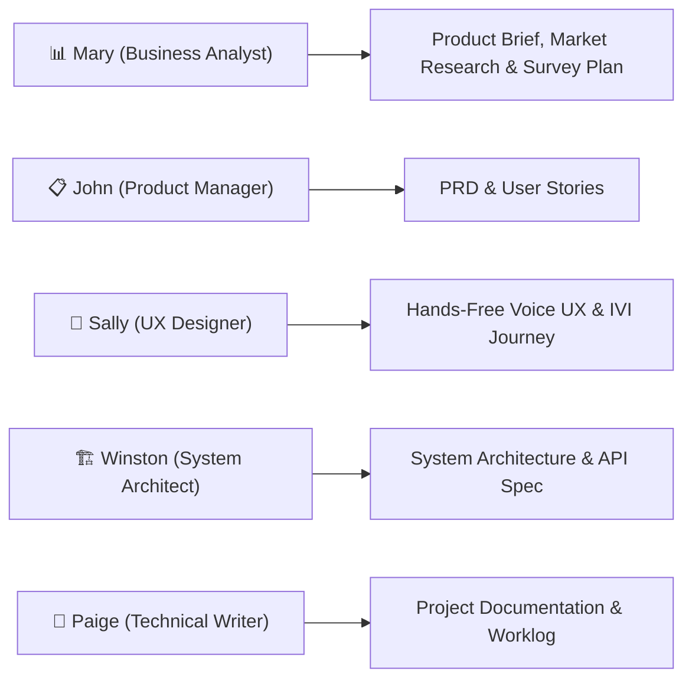

# 🚗 VIVI Cabin Copilot — Trợ lý Giọng nói & Đa phương thức trong Xe chạy trên Edge

> **Dự án chính thức cho Học viên VinUni AI20K Build Phase — Team P-192**  
> **Giải pháp Trợ lý AI Offline-First, Agentic Tool Calling & Grounded RAG cho Ô tô Thông minh**

---

## 🎯 Giới thiệu Dự án

**VIVI Cabin Copilot** là trợ lý ảo trí tuệ nhân tạo thế hệ mới hoạt động trực tiếp trên cụm hệ thống thông tin giải trí (IVI / Edge Gateway) trong xe ô tô. Dự án được thiết kế đặc biệt nhằm giải quyết triệt để các bài toán nhức nhối hiện nay của trợ lý giọng nói trên xe hơi: phụ thuộc kết nối Internet, phản hồi chậm, RAG bịa đặt thông tin kỹ thuật và tốn nhiều tài nguyên phần cứng.

---

## 🛑 4 Vấn đề Thực tế & Giải pháp AI

| # | Vấn đề Thực tế | Giải pháp của VIVI Cabin Copilot |
|---|----------------|----------------------------------|
| 1 | **Mất mạng là "Câm"** (Mất 4G khi vào hầm/núi) | **Edge SLM Local (Qwen2.5-3B q4):** Chạy 100% Offline trực tiếp trên thiết bị Edge |
| 2 | **RAG bịa thông tin kỹ thuật xe (Hallucination)** | **Grounded RAG (FAISS + SQLite):** Trả lời chính xác và bắt buộc kèm trích dẫn số trang sổ tay xe |
| 3 | **AI gọi nhầm chức năng xe** | **LangGraph Agentic Pipeline:** Tự động nhận diện Intent & Tool Calling chuẩn xác |
| 4 | **Nguy cơ an toàn khi thao tác xe ở tốc độ cao** | **HITL Safety Gatekeeper:** Yêu cầu tài xế xác nhận Popup trên IVI đối với các lệnh nhạy cảm |

---

## 👥 Phân công Vai trò theo Phương pháp BMAD (BMAD-v6 Framework)

Dự án áp dụng phương pháp phát triển phần mềm **BMAD-v6** (*Breakthrough Method for Agile AI-Driven Development*). BMAD định nghĩa 6 agent; dự án dùng 5 trong số đó cho khâu planning (vai Developer/Amelia do chính các thành viên đảm nhiệm, xem §Workstreams):



- **Analyst — Mary (Business Analyst):** Phân tích bài toán, nhu cầu tài xế/kỹ sư và lập bản [product-brief.md](_bmad-output/planning-artifacts/product-brief.md), [market-research.md](_bmad-output/planning-artifacts/market-research.md) và [user-survey-plan.md](_bmad-output/planning-artifacts/user-survey-plan.md).
- **Product Manager — John (PM):** Biên soạn bản [PRD.md](_bmad-output/planning-artifacts/PRD.md) và hệ thống [user-stories.md](_bmad-output/planning-artifacts/user-stories.md).
- **UX Designer — Sally (UX Designer):** Thiết kế kịch bản giao diện IVI và hành trình tương tác giọng nói rảnh tay [user-journey.md](_bmad-output/planning-artifacts/user-journey.md).
- **System Architect — Winston (System Architect):** Thiết kế kiến trúc [ARCHITECTURE.md](ARCHITECTURE.md), [architecture_diagram.md](docs/architecture_diagram.md), các quyết định kiến trúc [ADR.md](_bmad-output/planning-artifacts/ADR.md) và đặc tả API [VIVI_API_Spec.md](docs/VIVI_API_Spec.md).
- **Technical Writer — Paige (Technical Writer):** Hoàn thiện [README.md](README.md), [WORKLOG.md](WORKLOG.md) và [JOURNAL.md](JOURNAL.md).

---

## 🛠 Tech Stack

| Thành phần | Công nghệ / Framework | Vai trò / Ghi chú |
|------------|-----------------------|-------------------|
| **AI Agent Orchestrator** | LangGraph + LangChain | Điều phối StateGraph, Tool Calling & HITL |
| **Local SLM Model** | Qwen2.5-3B-Instruct (Q4_K_M) | `llama-server` local ở `SLM_ENDPOINT` (mặc định `:8093`). **Mặc định tắt** (`SLM_ENABLED=false`) |
| **Backend Service** | FastAPI + Uvicorn | Web REST APIs, async streaming |
| **Vector Store & RAG** | FAISS `IndexFlatIP` + SQLite (embedded) | Tra cứu Sổ tay Xe; embedding `multilingual-e5-small` ([ADR-003](docs/adr/ADR-003-local-rag-stack.md)) |
| **Frontend IVI UI** | Next.js 16 + TypeScript | Màn hình IVI cho Tài xế & Dashboard Kỹ sư (`/login`, `/driver`, `/engineer`) |
| **Audio Processing** | Zipformer int8 (sherpa-onnx) & Piper TTS | Chuyển đổi Giọng nói tiếng Việt local (STT / TTS) |
| **Virtual Vehicle** | Mosquitto MQTT Broker | Mô phỏng tín hiệu xe ảo & trạng thái vật lý |
| **DevOps & Deploy** | Docker Multi-Stage + GitHub Actions | Đóng gói Container & CI/CD tự động |

---

## 🚀 4 Workstreams Kỹ thuật trong Team

| Workstream | Nội dung Phụ trách | Thành viên |
|------------|-------------------|------------|
| **WS1: Voice & Edge Runtime** | Tích hợp Zipformer int8 ASR (sherpa-onnx), Piper TTS VN, llama.cpp local server | Nhân |
| **WS2: Agent & RAG Pipeline** | Tích hợp LangGraph StateGraph, registry 16 tool xe, FAISS Grounded RAG | Nhân & Thành Nguyễn |
| **WS3: Virtual Vehicle & Safety HITL** | Mô phỏng xe ảo MQTT, API Gateway, Cổng xác nhận HITL an toàn | Thành Nguyễn |
| **WS4: IVI Web UI & Dashboard** | Dựng màn hình IVI Next.js cho Tài xế & Engineer Diagnostics Dashboard | Sơn Hà & Giáp |

---

## 📊 Trạng thái Agent Pipeline (WS2)

| Hạng mục | Trạng thái | Bằng chứng |
|---|---|---|
| StateGraph + registry 16 tool xe (SCRUM-16) | **Chạy được trên PC** | `src/agents/graph.py`, `src/services/tool_registry.py`. Số test hiện hành được đo lại và duy trì tại [`docs/huong_dan_chay.md` §3.5](docs/huong_dan_chay.md) — đừng trích số cứng ở đây, nó lỗi thời trong vòng một tuần |
| Tra cứu sổ tay VF9 (SCRUM-17) | **Chạy được trên PC** | `tests/test_rag_integration/` 6/6 pass. Index: 58 tài liệu, 482 chunk, `page_exact_rate` 1.0, bản `VF9_23-25_VN_VI_2.4` |
| Câu hỏi tới được RAG | **0,9833** (59/60) | run [`eval/results/agent-routing/20260808T054620.836304Z/`](eval/results/agent-routing/20260808T054620.836304Z/metrics.json). Đo trên `eval/datasets/manual/v1` — 60 câu do workstream RAG soạn cho mục đích khác, **không** do người viết router soạn |
| Câu hỏi bị thực thi thành lệnh | **0** | cùng run. Đúng 0 vì cấu trúc: câu hỏi khớp luật điều khiển đi vào `offer` (nêu việc sẽ làm rồi hỏi lại), không chạm executor |
| Câu hỏi bị từ chối oan | **0** (trước 5/60) | cùng run. Lỗi `có…không?` bị đọc thành phủ định đã sửa |
| Độ chính xác lệnh (không hồi quy) | **1,0000** | cùng run, trên `agent/v3` |
| Qwen2.5-3B q4 làm planner | **Chạy được trên PC**, **mặc định tắt** | Weight thật đã chạy trong SPIKE-003: 8 run với `qwen2.5-3b-instruct-q4_k_m` (và 9 run với bản 0.5B) tại [`eval/results/spike-003/`](eval/results/spike-003/). Run `rungC-quality` `20260811T121701.052663Z`: 64 ca, p50 **991,8 ms**, đỉnh RSS **1.988 MB**. `SLM_ENABLED=false` là mặc định theo ADR-006/ADR-010; ADR-016 định nghĩa hai vai SLM (planner cho câu luật không khớp, và câu mở đầu cho trả lời sổ tay). SPIKE-001 — một pipeline **khác** — vẫn giữ kết luận **Not Yet** |
| HITL (SCRUM-18) | **Chạy được trên PC** | `POST /api/v1/approvals/{approval_id}/decision`. Phủ **7/19** required safety test của `safety_and_hitl.md` (#1, #2, #4, #5, #6, #12, #17) — xem `tests/test_agents/test_hitl_safety.py` |
| Gọi bằng wake word "Hey Vi Vi" | **Chạy được trên PC**, **dưới cổng** | recall **0,696** trên tập held-out (195/280) — **dưới cổng 0,95 nhóm tự đặt**. Cổng kích hoạt nhầm thì đạt: 0/60 trên từ gần âm, 2/474 toàn bộ. Run [`eval/results/wake-word/2026-08-21T14-12Z-v8-sequence-head/`](eval/results/wake-word/2026-08-21T14-12Z-v8-sequence-head/README.md). **Vẫn ship cho bản demo BTC theo quyết định PM/PO** — README của run ghi "must not be shipped" là khuyến nghị kỹ thuật, và nó bị ghi đè có chủ ý, có thời hạn. Khi `NEXT_PUBLIC_WAKE_WORD_ENABLED=true`, bộ dò xin và giữ micro trong lúc ở `/driver` (trừ các lần tạm dừng để thu lệnh); không có công tắc bật/tắt trong app, nên feature flag deploy là điểm kiểm soát duy nhất. Giao diện chỉ mời gọi bằng giọng khi bộ dò thật sự đang nghe; thiếu model thì tự quay về "Chạm mic để ra lệnh" |
| Wake word đo trên giọng người thật | **Chưa có bằng chứng** | Toàn bộ 2h12m corpus là giọng tổng hợp. Tác giả thử tay trong phòng kín: không hụt lần nào — **quan sát, không phải phép đo** (một người, một phòng, không đếm, không nhiễu nền) |

> **Giới hạn của HITL bản này** *(cập nhật 2026-08-26 — ba trong bốn giới hạn cũ đã đóng)*.
>
> **Đã đóng.** Route quyết định **nay có xác thực**: `require_driver` bảo vệ
> `POST /api/v1/approvals/{approval_id}/decision` (`src/api/approvals.py`), xếp chồng lên
> quyền sở hữu phía server sẵn có (`approval_id` băm từ session+lượt+plan nên không đoán
> được; sai phiên trả `approval_not_owned`). Bản README trước mô tả đây là "capability,
> không phải xác thực" — mô tả đó đã lỗi thời kể từ khi `src/api/auth_deps.py` ra đời.
> Approval, session, user và bản ghi idempotency **nay nằm trong SQLite** (ADR-017), kèm
> partial unique index khoá luật "mỗi session tối đa một approval đang chờ" ở tầng database.
> Xác nhận **bằng giọng nói** đã làm (`src/agents/voice_intent.py`) và vẫn đi qua đúng cửa
> REST như `safety_and_hitl.md` yêu cầu — không mở cửa thứ hai vào executor.
>
> **Còn lại.** Hết hạn vẫn được phát hiện lúc **đọc**, không có worker phát `turn.canceled`
> tại `expires_at`. Và bản ghi approval sống sót restart **nhưng lượt thoại thì không**:
> `session_state.get_graph()` dùng `InMemorySaver`, checkpoint giữ `interrupt()` chết theo
> tiến trình, nên `invalidate_orphaned_pending_approvals()` fail chúng closed lúc khởi động.
> Đó là fail-closed đúng thiết kế, không phải bug — nhưng nó có nghĩa là **không lượt nào
> tự chạy tiếp sau restart**. Chưa chạy thử trên hai worker.
>
> **Nợ test.** Vẫn mới phủ **7/19** required safety test của `safety_and_hitl.md`. Đóng phần
> nợ này đáng làm trước khi chồng thêm tính năng lên nền test hở.

> **Hai dataset, hai vai trò khác nhau — đừng đọc lẫn.**
> `agent/v3` do chính người viết router soạn, biết trước luật; nó cho `intent_accuracy`
> 1,0000 nhưng chỉ dùng để **bắt hồi quy**, không nói gì về khả năng tổng quát hóa.
> `manual/v1` do workstream RAG soạn cho mục đích khác nên độc lập với router — đó là
> lý do con số 0,9833 có ý nghĩa hơn. Nhưng nó **vẫn là người trong nhóm**, không phải
> người dùng thật, và không đi qua ASR nên không phản ánh lỗi nhận dạng giọng nói.

Ví dụ thật (chạy trên index đã dựng):

```
"Ghế xe có chức năng massage không?"
  -> grounded_answer · Ghế và hệ thống an toàn / Ghế, trang 14 (score 0.898)
"Cách thay dầu động cơ xăng của VF9"
  -> grounded_refusal (VF9 chạy điện — từ chối, không bịa)
"Mở cửa sổ bên lái 30 phần trăm được không?"
  -> offer · "Tôi có thể đưa kính trước bên lái về 30%. Bạn có muốn tôi thực hiện không?"
```

Tên tool là **canonical end-to-end** — giống nhau trong `ActionPlan`, trace và HTTP
response. Bảng alias Họ A (`control_ac`…) đã bị bỏ 2026-08-08: WS4 chốt dùng
`docs/api_spec.md` làm nguồn sự thật duy nhất nên nó không còn consumer.

Phân loại an toàn theo `docs/safety_and_hitl.md`, **không** theo ngưỡng
`speed > 5 km/h` ghi trong `docs/VIVI_API_Spec.md` — lý do tại
[ADR-010](docs/adr/ADR-010-canonical-tool-registry-with-product-vision-adapter.md).
Mặc định định tuyến sang tra sổ tay: [ADR-011](docs/adr/ADR-011-default-route-to-manual-lookup.md).

> `POST /api/v1/agent/process` là route **dev-only**, `include_in_schema=False` và trả 404 khi
> `APP_ENV=production`. `docs/api_spec.md` chốt **14** interface P0 và không có route agent
> tổng quát; FE dùng `POST /api/v1/turns/text` khi route đó được implement. Đừng gọi vào đây.

**Composer trích nguyên văn, và cố ý không tổng hợp.** Câu trả lời sổ tay nay gồm một câu
mở đầu cộng **nguyên văn đoạn evidence hạng nhất** (`_quote_top_evidence` trong
`src/agents/nodes/compose.py`), cắt ở ranh giới câu kèm dấu "còn tiếp" khi vượt
`QUOTE_MAX_CHARS`. Nguồn là `evidence[0].text`, **không** phải `citation.excerpt` — excerpt
bị cắt ở 300 ký tự trong khi 39/40 chunk thật dài hơn, và cắt đúng là cách làm rơi mất các
điều kiện phiên bản trong sổ tay.

Node `compose_grounded_answer` của `agent_spec.md` **cố ý không viết**: [ADR-015](docs/adr/)
ghi lại phép đo cho SLM viết lại chunk — **4/40 câu trả lời sai lệch**, tất cả đều do rơi mất
điều kiện biến thể (ECO/PLUS, SDI/CATL), so với **0/40** khi trích nguyên văn.

---

## ⚡ Quick Start (Hướng dẫn Chạy Dự án)

### 1. Setup môi trường Python
```bash
# Clone repository
git clone https://github.com/AI20K-Build-Phase-Cohort-3/P-192.git
cd P-192

# Khởi tạo venv Python 3.11
python3.11 -m venv .venv
source .venv/bin/activate  # Trên Windows: .venv\Scripts\activate

# Cài đặt dependencies
pip install -e ".[dev]"

# Tra cuu so tay (RAG) can them nhom nang nay - keo theo torch ~2GB, CI khong cai
pip install -r requirements-rag.txt

# Cấu hình môi trường — KHÔNG có API key nào, dự án chạy offline hoàn toàn
cp .env.example .env
```

### 2. Khởi chạy FastAPI Server
```bash
# Windows: BẮT BUỘC dùng lệnh này, không dùng uvicorn trực tiếp.
python -m src.serve
```
- Mở tài liệu API (Swagger UI): `http://localhost:8000/docs`

> ⚠️ **Không chạy `uvicorn src.main:app` trên Windows.** uvicorn chọn `ProactorEventLoop`, loop này
> thiếu `add_reader`/`remove_writer` mà `paho-mqtt` cần, nên **mọi kết nối MQTT ném
> `NotImplementedError`**. `src/serve.py` sinh ra chính vì chuyện đó. Trong container Linux thì
> `uvicorn` bình thường.

> 📘 **Chạy trọn hệ thống** (broker MQTT + xe mô phỏng + backend + giao diện IVI, kèm dựng index
> RAG và model giọng nói): xem **[docs/huong_dan_chay.md](docs/huong_dan_chay.md)** — runbook chính
> thức, đã kiểm chứng trên máy sạch. Riêng `pip install -e ".[dev]"` ở trên **chưa đủ** để chạy
> demo: clone xong vẫn thiếu corpus sổ tay, index RAG và model STT/TTS.

> 🧪 **Kiểm thử**: cửa vào duy nhất là **[docs/testing.md](docs/testing.md)** — chạy bằng lệnh gì,
> coverage bao nhiêu, bốn tầng L0–L3 của MQTT chứng minh và **không** chứng minh được điều gì, và
> 26 bộ evaluation evidence. (`docs/guide/` là giáo trình của BTC được vendor vào repo, không phải
> tài liệu của dự án này.)

### 3. Biến môi trường

Nguồn chuẩn là [`.env.example`](.env.example) — copy thành `.env` rồi sửa. Dưới đây là những biến
thật sự quyết định hành vi:

| Biến | Mặc định | Ý nghĩa |
|---|---|---|
| `DATABASE_URL` | `sqlite:///./data/app.db` | **Phải là SQLite.** Còn dòng `postgresql://` cũ thì backend chết lúc import |
| `MQTT_ENABLED` | `true` | Đặt `false` khi chạy test, nếu không mỗi `TestClient(app)` chờ broker 10 s |
| `MQTT_URL` | `mqtt://localhost:1883` | Đổi cùng `MQTT_HOST_PORT` nếu 1883 bị chiếm |
| `MQTT_HOST_PORT` | `1883` | Cổng publish của container Mosquitto |
| `MQTT_BACKEND_USERNAME` / `_PASSWORD` | `vivi-backend` / *(trống)* | Sinh bằng `scripts/bootstrap_mqtt_secrets.ps1`, **không commit** |
| `MQTT_SIMULATOR_USERNAME` / `_PASSWORD` | `vehicle-simulator` / *(trống)* | Như trên |
| `VEHICLE_ID` | `vehicle-demo-01` | Id xe mô phỏng |
| `RAG_INDEX_DIR` | `./data/rag/vf9_2026_vi` | Index sinh bởi `scripts/prepare_vf9_index.ps1` |
| `RAG_MIN_SCORE` | `0.848` | Dưới ngưỡng này thì trả "không tìm thấy trong sổ tay" |
| `APP_HOST` / `APP_PORT` | `0.0.0.0` / `8000` | Backend |
| `CORS_ORIGINS` | `http://localhost:3000,...` | Cho giao diện IVI |

**Ba biến của LLM không nằm trong `.env.example`** — chúng chỉ có mặc định trong
[`src/config.py`](src/config.py). Muốn đổi thì tự thêm dòng vào `.env`:

| Biến | Mặc định (`src/config.py`) | Ý nghĩa |
|---|---|---|
| `SLM_ENABLED` | `false` | **Tắt là đúng thiết kế** (ADR-006/010) — router là luật tất định, không có LLM trên đường chạy mặc định. Bật thì xem [runbook Phần IV](docs/huong_dan_chay.md) |
| `SLM_ENDPOINT` | `http://127.0.0.1:8093` | llama-server, chỉ dùng khi `SLM_ENABLED=true` |
| `SLM_MODEL_ID` | `qwen2.5-3b-instruct-q4_k_m` | Model GGUF đang nạp |

Frontend đọc **`frontend/.env.local`** riêng (file này gitignored). Ba cờ `NEXT_PUBLIC_USE_MOCK_*`
phải **cùng** `false` thì giao diện mới nối backend thật — thiếu một cái là còn một nửa chạy giả.
Chi tiết ở [runbook §2.7](docs/huong_dan_chay.md).

### 4. Câu lệnh mẫu để thử

Đăng nhập ở <http://localhost:3000/login> bằng `driver.demo@example.com` / `DemoDriver123!`
(bấm thẳng nút **"Bắt đầu lái"** cũng được), rồi gõ ở màn hình tài xế:

| Gõ thử | Hệ thống làm gì |
|---|---|
| `Đặt điều hòa 24 độ` | **S1** — thực thi ngay, xe mô phỏng đổi trạng thái |
| `Mở kính bên lái 30%` | **S2** — hỏi *"Bạn có đồng ý không?"*, duyệt rồi mới chạy |
| `Mở cửa bên lái` *(xe đứng yên)* | **S2** — hỏi xác nhận |
| `Mở cửa bên lái` *(sau khi gõ `speed 45` ở cửa sổ xe mô phỏng)* | **S3** — chặn thẳng, **không** hộp thoại |
| `Áp suất lốp khi lốp nguội là bao nhiêu?` | Trích **nguyên văn** sổ tay VF9 kèm citation có số trang |
| `Xe báo lỗi phanh thì làm gì?` | Tra sổ tay, hoặc báo không tìm thấy nếu ngoài phạm vi corpus |

Bật thêm LLM (`SLM_ENABLED=true`, xem [runbook Phần IV](docs/huong_dan_chay.md)) thì có thêm:

| Gõ thử | Hệ thống làm gì |
|---|---|
| `Xin chào cabin copilot` | LLM tự viết câu chào |
| `Chuyển khoản giùm tôi 2 triệu cho anh Ba` | LLM từ chối đúng phạm vi, không tạo hành động |
| `Vặn nhạc to lên chút` | LLM lập kế hoạch `media_control` → xe đổi âm lượng thật |
| `Bật đèn trong xe lên` | LLM lập kế hoạch `set_interior_light` |

> Output thật của 8 ca trên, kèm cấu hình đã chạy và cả một ca **không đạt**, nằm ở
> [`docs/reports/g2-eval-evidence.md`](docs/reports/g2-eval-evidence.md).

---

## 📋 10 Deliverables Checklist (BTC VinUni AI20K)

- [x] **1. Source Code (GitHub):** Cấu trúc chuẩn `src/`, `tests/`, `experiments/offline_poc/`
- [x] **2. README.md:** Hoàn thiện theo chuẩn dự án VIVI Cabin Copilot
- [x] **3. Architecture Diagram:** Xem [docs/architecture_diagram.md](docs/architecture_diagram.md)
- [x] **4. AI Logs:** Tích hợp auto-logging hooks trong `.ai-log/`
- [x] **5. Live URL:** **https://c4-app-192.io.vn/** — VPS tự dựng (Caddy + Docker), không phải PaaS. Kiểm chứng bằng `curl https://c4-app-192.io.vn/healthz`: 2026-08-31 trả `status: ready` với **8/8** thành phần `ready` (`backend`, `llm`, `mqtt`, `vehicle_simulator`, `stt`, `tts`, `rag_index`, `sqlite`). Vận hành: [docs/deploy_vps_van_hanh.md](docs/deploy_vps_van_hanh.md)
- [ ] **6. Video Demo:** Video demo 3-5 phút màn hình IVI
- [ ] **7. Pitch Deck:** Slide thuyết trình thuyết phục Demo Day
- [x] **8. Development Journal:** Ghi chép tại [JOURNAL.md](JOURNAL.md)
- [x] **9. Worklog:** Ghi nhật ký công việc tại [WORKLOG.md](WORKLOG.md)
- [x] **10. Evaluation Evidence:** **26 bộ / 214 run** bất biến trong `eval/results/`, **17 bộ được ADR hoặc report trích dẫn đích danh** (bảng đầy đủ ở [docs/testing.md §4](docs/testing.md)). Kiểm thử tự động: **3.328 test backend + 612 test frontend**, coverage `src/` **92,01%** (đo 2026-08-31, lệnh tái lập ở [docs/testing.md §2](docs/testing.md)). [eval/results/report.md](eval/results/report.md) chỉ là báo cáo **SPIKE-001** — một spike đã kết luận *Not Yet* và không còn trên đường giao hàng

---

## 📄 License
MIT License — VinUni AI20K Build Phase (Cohort 3).
