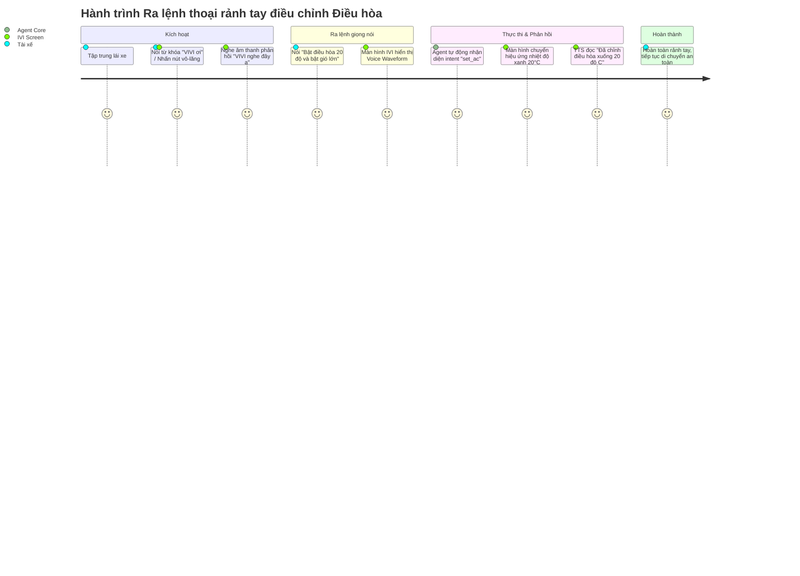

# 🎨 BMAD User Journey & Hands-Free Voice UX Specs: VIVI Cabin Copilot

**Tác giả:** Sally (UX Designer)  
**Dự án:** VIVI Cabin Copilot — Trợ lý ảo đa phương thức trong xe hơi  
**Phiên bản:** 1.1 | **Ngày:** 2026-08-03 | **Trạng thái:** ✅ Đã cập nhật chi tiết  

---

## 1. Hành trình Người dùng Chi tiết (Detailed User Journeys)

### 1.1. User Journey A: Tài xế ra lệnh thoại rảnh tay khi lái xe trên cao tốc
- **Nhân vật:** Anh Minh (Tài xế, 35 tuổi).
- **Ngữ cảnh:** Xe đang di chuyển 80 km/h trên cao tốc, cabin bị nóng.

---

### 1.2. User Journey B: Tra cứu đèn cảnh báo táp-lô & Xác nhận an toàn HITL
- **Nhân vật:** Anh Minh (Tài xế).
- **Ngữ cảnh:** Xe xuất hiện đèn vàng cảnh báo hình chiếc ấm trên táp-lô.

1. **Khởi đầu (Trigger):** Tài xế nhìn thấy đèn vàng phát sáng và lo lắng xe gặp sự cố.
2. **Hỏi thông tin (RAG Query):** Tài xế hỏi: *"Đèn hình chiếc ấm màu vàng là lỗi gì?"*.
3. **Phản hồi RAG Grounded:**
   - Agent truy vấn ChromaDB và đọc giọng nói: *"Theo trang 45 sổ tay VIVI, đây là đèn cảnh báo áp suất dầu động cơ thấp. Bạn nên tắp vào lề đường kiểm tra..."*.
   - Màn hình IVI hiển thị khung trích dẫn số trang chính xác.
4. **Lệnh nguy hiểm & Kịch bản HITL (High-speed Safety Gate):**
   - Tài xế nói tiếp: *"Mở hết cửa kính để hạ nhiệt"*.
   - Do xe đang chạy tốc độ 75 km/h, hệ thống kích hoạt **HITL Safety Gate**:
     - Màn hình IVI nổi bật Modal Cảnh báo màu cam:  
       ⚠️ **XÁC NHẬN AN TOÀN:** *Xe đang chạy 75 km/h. Bạn có chắc chắn muốn mở hết cửa kính không?*  
       `[Xác nhận]` `[Hủy bỏ (Tự hủy sau 5s)]`
   - Tài xế bấm chọn `[Hủy bỏ]` (hoặc im lặng quá 5s), hệ thống thông báo: *"Đã hủy thao tác mở cửa kính để đảm bảo an toàn vận hành"*.

---

### 1.3. User Journey C: Kỹ sư theo dõi Dashboard & Debug Logs
- **Nhân vật:** Chị Lan (Kỹ sư hệ thống, 28 tuổi).
- **Ngữ cảnh:** Kiểm thử chất lượng phần mềm IVI tại phòng Lab hoặc trên xe chạy thử.

1. **Đăng nhập:** Đăng nhập với vai trò "Kỹ sư hệ thống" -> Vào Engineer Dashboard.
2. **Theo dõi Realtime Metrics:**
   - Xem biểu đồ biến động Latency end-to-end (ms).
   - Xem tỷ lệ nhận diện đúng Intent Accuracy (Target >85%) và Grounded Rate (Target >90%).
3. **Debug Audit Logs:**
   - Nhấn vào từng lượt log tương tác để kiểm tra: Prompt input, Extracted Intent, Tool Calls JSON, Similarity Score từ ChromaDB, và thời gian phản hồi của từng Node.

---

## 2. Nguyên tắc Thiết kế Giao diện Hands-Free Voice UX (IVI Design Rules)

1. **Rule 1 — Visual Glance Time < 2s:** Phông chữ hiển thị lớn (>24px), chế độ Dark Mode tương phản cao, thẻ thông tin rảnh tay giúp tài xế quan sát dưới 2 giây.
2. **Rule 2 — Voice-First Feedback Loop:** Mọi thao tác xe thành công hoặc cảnh báo đều được phản hồi bằng câu thoại tiếng Việt ngắn súc tích qua giọng Piper TTS.
3. **Rule 3 — Driving Mode Auto-Lock:** Tự động kích hoạt khi tốc độ xe `speed > 5 km/h`, ẩn các menu cài đặt sâu, bắt buộc ra lệnh bằng giọng nói.
4. **Rule 4 — Clear HITL Safety Modals:** Popup xác nhận an toàn có màu cam/đỏ nổi bật, nút bấm rộng dễ chạm và tự động timeout hủy lệnh sau 5 giây nếu không tương tác.
