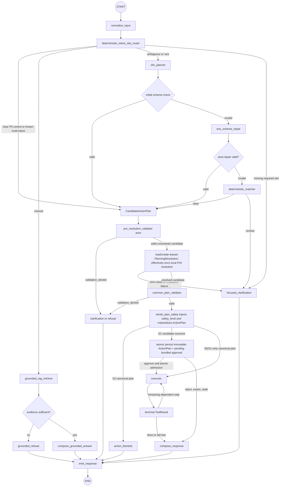

# Agent Specification

Safety and admission rules in [Safety and Human-in-the-Loop Specification](safety_and_hitl.md), entities in [Data Model and Messaging Specification](data_model.md), and [ADR-006](adr/ADR-006-p0-modular-monolith-deterministic-routing-calibrated-hitl.md) are authoritative.

## Agent boundary and deterministic-first graph

The agent is a set of bounded LangGraph modules inside the `backend` modular monolith, sharing its checkpointer and ports. It is not an autonomous service and cannot bypass backend authorization, safety, or executor modules.

Routing is deterministic first:

1. Normalize input.
2. Run deterministic intent/slot routing. A clear P0 command produces an internal typed `CandidateActionPlan` directly.
3. Route manual questions to grounded RAG.
4. Route only ambiguous or rare requests to the SLM planner, then run its initial schema check.
5. On initial schema failure, make exactly one schema-repair attempt. If the repair is invalid, use deterministic matcher, then one focused clarification or refusal. There is no open repair loop or ReAct loop.

Before normal control planning, a deterministic approval-intent recognizer checks a distinct voice turn against the owned session's single pending approval. On an unambiguous approve/reject it emits typed `approval.intent.detected` context for the IVI, but does not commit a decision; only the IVI's REST decision call can do that. Ambiguity or no pending approval terminates this intent turn safely with no plan or side effect.

## State schema

| Field | Producer → consumers | Contract |
|---|---|---|
| `session_id`, `turn_id`, `trace_id`, `schema_version` | API → all nodes | Canonical correlation and schema fields. |
| `input_text`, `input_confidence`, `normalized_text` | input/normalize → router | Bounded transcript or text; confidence is null for text. |
| `route_source`, `confidence`, `intent`, `slots` | deterministic router or SLM → graph | `route_source` is `deterministic`, `rag`, `slm`, or `fallback`; calibrated confidence is evidence, never a safety decision. |
| `vehicle_snapshot`, `vehicle_state_version` | state loader → planner/safety/executor | Canonical snapshot contains `state_version`; the server copies it to planning `vehicle_state_version`. Executor re-reads authoritative state. |
| `candidate_action_plan` | deterministic router or SLM → initial schema/common validator/safety | Internal candidate schema only; it contains no planner-supplied `safety_level`. |
| `planning_resolutions` | POI resolver → common validator/trace | Persisted plan-independent record with stable candidate digest/step ID, lease and one observable terminal outcome; candidate itself remains transient. These are not `ToolResult` records or executable steps. |
| `action_plan` | whole-plan safety → approval/executor/trace | Canonical policy-materialized `ActionPlan`, persisted immutable before approval/execution. |
| `evidence` | RAG → grounded composer/citation validator | Chunk IDs, scores, document/version; no unsupported claims. |
| `approval`, `approval_id`, `approved_vehicle_state_version` | safety/HITL → executor | Immutable server-side approval binding and public version name. |
| `execution_group_id`, `expected_state_version`, `step_results` | safety/executor → response/trace | Admission group and rolling versions; terminal `ToolResult` records. |
| `versions` | backend → trace | Prompt/model/tool/index/data versions. |
| `response`, `error` | composers → API/WS | User-safe output and stable error code; never hidden reasoning. |

Trip memory is limited to current-session summaries, resolved references, and short-lived preferences. It is not a safety source, cannot override slots/policy, contains no raw audio or chain-of-thought, and is deleted at session end.

## Node contracts

| Node | Must do | Must not do | Failure path |
|---|---|---|---|
| `normalize_input` | normalize whitespace, Vietnamese number/unit forms, and transcription artifacts without inventing a target | infer missing actuator values | focused clarification |
| `deterministic_intent_slot_router` | cover high-frequency Vietnamese P0 intents/synonyms, including nearest-cafe/coffee lookup, and decompose known P0 multi-intents into one typed candidate with explicit dependencies | call SLM for clear P0; assign safety; execute tools | RAG, SLM, or clarification |
| `pre_resolution_validator` | purely validate the unresolved candidate allowlist, every tool schema/range, dependency DAG, and `destination_ref` legality before lookup | perform lookup, mutate state, classify safety, or execute a side effect | `validation_denied` with no lookup |
| `resolve_validated_local_poi_effectively_once` | after pre-validation, compute stable candidate identity, load/create the leased unique `PlanningResolution`, reuse its terminal outcome or let the lease owner perform the pure pinned-fixture read; an expired lease may be reclaimed/recomputed after crash, while CAS persists exactly one observable terminal outcome | use `plan_id`, persist the candidate as a canonical plan, create a `ToolResult`, use network POI, trust a model destination, steal a live lease, persist a second terminal record, or execute any actuator side effect | persisted `empty`/`failed` resolution then clarification with no canonical plan or side effect |
| `grounded_rag_retrieve` | retrieve profile-filtered manual evidence and grade coverage | answer from general knowledge | grounded refusal |
| `slm_planner` | propose only ambiguous/rare `CandidateActionPlan` or grounded composition | emit `safety_level`, assign safety, authorize, publish MQTT, invoke a tool, or claim success | initial schema check |
| `common_plan_validator` | validate allowlist, typed args, ranges, dependency DAG, IDs/idempotency/state mappings for the whole plan | classify S0–S3 or invoke schema repair | `validation_denied` to clarification/refusal only; never repair |
| `whole_plan_safety` | deterministically inject server-owned `safety_level` into every valid step, compute `requires_approval`, add server-owned identifiers/context, and materialize the canonical immutable `ActionPlan` | accept planner safety fields or execute S3 | block, one bundled approval, or executor |
| `request_approval` | after full validation/policy, atomically persist the immutable S2 `ActionPlan` and one bound pending approval in one DB transaction, with the one-pending/session unique check inside that transaction, then interrupt | leave an orphan plan/approval after conflict, create a second pending approval, or execute a side effect before admission | transaction rollback + `APPROVAL_ALREADY_PENDING` clarification with no plan/group/side effect; otherwise reject/expire/invalidation response |
| `recognize_approval_intent` | for a distinct voice turn, bind an unambiguous approve/reject intent to the single owned pending `approval_id`/version and emit a typed handoff event | consume/reject an approval, call MQTT, or create a WebSocket decision contract | failed/canceled intent turn on ambiguity/no pending; otherwise IVI performs REST decision |
| `executor` | use allowlisted backend port, rolling state versions, fail-fast group semantics, and exactly one retry only for transient transport failure before terminal result, using the same command/idempotency key | retry validation, policy, tool-semantic rejection, or arbitrary model MQTT topic | terminal `ToolResult` then compose |
| `grounded composer` | map claims to evidence/citation IDs and refuse when insufficient | fabricate evidence | grounded refusal |
| `response composer` | report only verified outcomes and partial failure | expose trace internals or assert unverified success | emit response |

`validation_denied` happens before S0–S3: unknown tools, schema-invalid arguments, and out-of-range values are invalid—not S3. S3 means a valid action forbidden in the current vehicle state. An S3 has no side effect and no approval. Any S2 creates one bundled approval before any side effect in the plan. Creation/admission, `execution_group_id`, rolling versions, external-mutation detection, and fail-fast behavior are delegated to the canonical safety policy and executor.

### Candidate-to-canonical plan boundary

Internal `CandidateActionPlan` has exactly `schema_version` and `steps`; each candidate step has `step_id`, `ordinal`, `tool`, `args`, and `depends_on`. It has no `safety_level`, `plan_id`, or `requires_approval`. Session, vehicle, planning snapshot, and trace context remain trusted graph state rather than planner output. An SLM response that supplies `safety_level` fails its initial closed-schema check; after the one allowed repair, any remaining invalidity follows deterministic fallback. Deterministic candidates use the same closed schema.

The pure `pre_resolution_validator` validates the unresolved `CandidateActionPlan` before any POI lookup: tool allowlist, closed schemas/ranges, dependency DAG, exactly-one start-navigation target, and legal `destination_ref` pointing to an earlier `search_nearby_poi` listed in `depends_on`. It performs no I/O and does not classify safety. After planning resolution rewrites the candidate, `common_plan_validator` validates the resolved candidate again, including the concrete destination and remaining dependency graph. Only then does deterministic `whole_plan_safety` materialize every canonical safety field and the immutable `ActionPlan`. The public API, approval service, executor, and trace expose the canonical plan only; they never expose the internal candidate.

### Ghép mảnh trả lời câu hỏi lại (issue #148)

Quyết định nằm ở [ADR-025](adr/ADR-025-chap-hanh-tu-ngu-canh-hoi-lai.md); mục này là bản rút gọn để đọc tại chỗ. Sửa hành vi ở đây mà không mở ADR-025 là sửa một quyết định sản phẩm/an toàn bằng một PR triển khai.

Xe hỏi lại (`clarify`), tài xế đáp một mảnh (*"mức 2"*, *"18 độ"*, *"bên lái"*), và lượt kế tiếp **được phép** ghép mảnh ấy vào câu của lượt trước rồi định tuyến lại. Chốt kiến trúc và bốn chốt an toàn dưới đây là điều kiện của phép ấy.

**Router vẫn tất định và vẫn không đọc trạng thái.** ADR-006/ADR-010 không bị đụng: `route(text)` chỉ được gọi lại với một **chuỗi khác**, không có state nào chui vào `router.py`. Ngữ cảnh sống ở node — cùng chỗ đứng và cùng lập luận với cổng *"nghe tiếp"* (`_tra_loi_loi_moi_nghe_tiep`) đã có từ #107: *node đọc được state, router thì không*. Vật chứa là kênh state của checkpoint LangGraph khoá theo `thread_id = session_id`, nên ngữ cảnh **chết cùng tiến trình**, đúng như ngữ cảnh đọc-dở.

Khác một điểm phải nói thẳng, vì nó là lý do mục này tồn tại: cổng *"nghe tiếp"* chỉ **diễn giải lại** một lượt thành hành vi đọc (S0), còn cổng này **dựng lệnh chấp hành** từ ngữ cảnh nhớ được.

**Ghép bằng nối chuỗi, không vá slot có cấu trúc.** `gốc + " " + mảnh` rồi route lại. Lý do là kết quả đo chứ không phải sở thích: `"chỉnh quạt gió mức 2 điều hòa" + "18 độ"` ra một plan **hai bước**, tức lấy lại cả ý `quạt mức 2` mà tầng vá-slot sẽ đánh rơi.

**Bốn chốt.** (1) chỉ lượt kế tiếp ngay sau — mọi lượt không phải câu hỏi lại **quét sạch** ngữ cảnh, và phép xoá ấy *là* chốt, không có bộ đếm lượt nào; (2) TTL 30 s, cùng bậc với HITL; (3) không ghép nếu lượt mới **tự khớp** `control` — ghép `"mở nhạc"` vào là nuốt mất một lệnh; (4) kết quả ghép phải có nghĩa: `control`, hoặc `clarify` với **lý do khác** (chuỗi slot tiến một bước), hoặc `denied` trừ `negated_command`.

**Chỉ những lý do `clarify` nêu được lựa chọn/dải mới ghép được** — đúng tập có lời riêng trong `CLARIFY_MESSAGES`, trừ `relative_change_unsupported`. `ambiguous_number`, `ambiguous_reference`, `unknown_local_destination` bị loại vì ghép chúng là đoán, không phải điền chỗ trống.

**Lệnh ghép ra đi qua policy/safety như mọi lệnh khác.** Cổng này chỉ thay `RouteDecision`; không có đường tắt nào tới executor, và một lệnh S2 ghép ra vẫn dừng ở `approval.required`.

**Rủi ro còn lại, và giả định mà bộ chốt dựa vào.** Router đọc được số viết chữ, nên `"hai"` ghép vào ra `control` thật (quạt mức 2, S1). Không có cổng ngôn ngữ nào phân biệt được *"hai"* trả lời máy với *"hai"* nói với người ngồi cạnh, và cổng kiểu "mảnh phải có chữ số" thì loại luôn `"mười tám độ"` — tức loại đúng đường thoại. Thứ thật sự chặn ca ấy hôm nay là **mic không tự mở sau một câu hỏi lại** (auto-listen chỉ gắn với `approval.required`), nên mảnh trả lời chỉ tồn tại khi tài xế chủ động bấm mic rồi nói. Bộ chốt trên được tính **với giả định ấy**: thêm auto-listen cho clarify, hoặc wake word, thì phải tính lại.

## Tool registry and planning invariants

The backend owns these exact typed schemas. Conditional fields are rejected when forbidden and required when their condition holds.

| Tool | Exact `args` schema and constraints | Safety |
|---|---|---|
| `get_vehicle_state` | `{}` | S0 |
| `query_manual` | `{query: string}` where trimmed `query` is 1..500 Unicode code points; vehicle/profile and `top_k` are server-derived/configured | S0 |
| `search_nearby_poi` | `{query: string, category?: enum["cafe","restaurant","fuel","parking"], limit?: integer}`; trimmed `query` is 1..100 Unicode code points, `limit` is 1..5 and defaults to 3; current location and vehicle profile are server-derived | S0 |
| `open_app` | `{app: enum["youtube","tiktok","spotify"]}`; closed enum, no URL parameter, no arbitrary app; IVI-local tool with no MQTT domain | S1 when `speed_kph == 0 && gear == "P"`, **S3 otherwise** (ADR-023) |
| `set_hvac_temperature` | `{temperature_c: number}` with `16 <= temperature_c <= 30` | S1 |
| `set_hvac_power` | `{enabled: boolean}` | S1 |
| `set_hvac_fan_level` | `{level: integer}` with `0 <= level <= 3` | S1 |
| `set_seat_heating` | `{seat: enum["front_left","front_right"], level: integer}` with `0 <= level <= 3` | S1 |
| `media_control` | `{action: enum["play","pause","next","previous","set_volume","play_track"], volume?: integer, track_id?: string}`; `volume` is required iff `action="set_volume"`, forbidden otherwise, and 0..100; `track_id` is required iff `action="play_track"`, forbidden otherwise, and must name a track that exists in `src/fixtures/media.json` | S1 |
| `set_navigation` | `{operation: enum["start","cancel"], destination_id?: string, destination_ref?: {from_step_id: string, selection: enum["first"]}}`; start requires exactly one of non-empty `destination_id` or `destination_ref`; cancel forbids both | S1 |
| `set_window_position` | `{window: enum["front_left","front_right","rear_left","rear_right"], percent: integer}` with 0..100 | S2 always |
| `set_door_state` | `{door: enum["front_left","front_right","rear_left","rear_right"], state: enum["open","closed"]}` | S2 only when `speed_kph == 0 && gear == P`; otherwise S3 |
| `set_seat_position` | `{seat: enum["front_left","front_right"], axis: enum["fore_aft","recline","height"], value: integer}` with 0..100 | S2 only when `speed_kph == 0 && gear == P`; otherwise S3 |
| `set_trunk_state` | `{state: enum["open","closed"]}` | S2 only when `speed_kph == 0 && gear == P`; otherwise S3 |
| `set_headlight_mode` | `{mode: enum["auto","low_beam","high_beam"]}`; there is deliberately no `off` value — UNECE R48 forbids a manual off position on vehicles with daytime running lamps (ADR-020) | S1 |
| `set_interior_light` | `{enabled: boolean}` | S1 |

> **Trạng thái cài đặt (#325, 27/08):** `destination_ref` **không tồn tại trong code**. ADR-010 §Scope boundary đã loại `PlanningResolution` khỏi sprint và yêu cầu validator từ chối trường này; tới #325 thì `SetNavigationArgs` ở `src/services/tool_registry.py` cũng bỏ nó, nên cả hai cổng cùng từ chối. Trước đó registry **nhận** nó rồi để simulator ném lỗi — chết muộn, sau khi đã qua safety và có thể cả HITL. Phần mô tả dưới đây là thiết kế đích, không phải hành vi hôm nay; dựng lại `destination_ref` cần ADR riêng.

Unknown tool, schema mismatch, forbidden/required conditional-field error, or out-of-range value returns `VALIDATION_DENIED` before S0–S3 with subcode `tool_not_allowed`, `args_invalid`, or `range_invalid`. The common validator never sends these failures to the SLM repair node. Exactly one repair exists only after the SLM's initial output-schema check, before the common validator.

The registry is server-owned and allowlisted. `search_nearby_poi` reads only a versioned local POI fixture and produces a typed `PlanningResolution.items` array—not a `ToolResult`. Each item is exactly `{destination_id, name, category, distance_m}`; all values are validated fixture data and no network request is allowed. For canonical executable steps, the server derives `command_id`, MQTT topic, transport parameters, and command idempotency key (`plan_id:step_id`); the model cannot provide or override them. Planning resolution instead uses the plan-independent key defined below.

For a `set_navigation.destination_ref`, `from_step_id` must name an earlier `search_nearby_poi` candidate step and must appear in the navigation step's `depends_on`; only `selection="first"` is valid at P0. The pure pre-resolution validator proves those conditions before lookup. Normalization uses Unicode NFC, schema defaults, canonical numbers and sorted object keys. Backend derives `candidate_step_id` from `turn_id + ordinal + normalized tool/args`, rewrites dependencies to those stable IDs, then computes `candidate_digest = sha256(canonical_json(normalized CandidateActionPlan))`. Both are stable across replay. It derives the plan-independent `idempotency_key = turn_id:candidate_digest:candidate_step_id:fixture_version` and transactionally loads or creates the unique persisted [`PlanningResolution`](data_model.md#planningresolution).

The record has status `started|succeeded|empty|failed`, pinned immutable `fixture_version`, `lease_owner`, `lease_expires_at`, typed items/selection, bounded error summary and timestamps. A live lease has one owner. An expired `started` lease can be reclaimed and the pure read can repeat after a crash against the same fixture; compare-and-set commits one terminal outcome only once. Replays/concurrent callers reuse that outcome. This is **exactly-once observable outcome / effectively-once**, not a physical exactly-once-read promise. On `succeeded`, the resolver rewrites `destination_ref` to the selected concrete validated `destination_id`, removes the POI step and its dependency from only the in-memory resolved candidate, and sends it through common validation/policy. The candidate is never persisted as a canonical plan; the checkpointer may retain workflow state plus derived IDs/digest only. The resolution is not a `ToolResult`, is not copied into `plan_steps`, and the executor cannot execute/replay it. `empty`, failed lookup, invalid result, or resolution mismatch persists the terminal resolution, yields one clarification, and creates no canonical `ActionPlan`, `ExecutionGroup`, navigation, HVAC, or other side effect for the whole user intent.

The policy-materialized `ActionPlan` is identical regardless of whether its candidate came from deterministic routing or SLM and exactly follows [the canonical data model](data_model.md#actionplan): `schema_version`, `plan_id`, `session_id`, `vehicle_id`, planning `vehicle_state_version`, ordered `steps`, and `requires_approval`. Each step has `step_id`, `ordinal`, `tool`, `args`, server-policy-assigned `safety_level`, and explicit `depends_on`. `turn_id` remains separate agent state and is not an `ActionPlan` field. Mixed plans have atomic admission. After policy materialization and persistence the plan is immutable: the backend stores `plan_digest = sha256(canonical_json(ActionPlan))`; edited arguments, added steps, or changed dependencies require a new candidate and plan and, if S2, a new approval. A bundled approval is bound to the immutable plan/user/session, matching `plan_digest`, and `approved_vehicle_state_version`; admission re-hashes the plan and re-reads actual state immediately before consuming approval and the first side effect, then uses rolling expected versions thereafter.

## Prompt boundaries, retries, and stopping

SLM prompts are limited to ambiguous planning and grounded composition. They do not handle deterministic P0 requests, safety classification, authorization, broker publishing, or completion claims. Manual text and user text are untrusted data, not policy instructions.

The graph stops after a complete response, clarification/refusal, safety block, approval reject/expiry/state invalidation/plan-digest invalidation/predicate failure, terminal executor failure, cancellation, or its 12-second pre-TTS deadline. Every accepted turn emits exactly one terminal event. A pending original command turn remains nonterminal; its distinct voice approval-intent turn completes after typed handoff without committing, or fails/cancels on ambiguity/no pending. The original command turn then terminalizes exactly once only after the REST decision/outcome. The only model retry is one schema repair, followed exactly by deterministic matcher and one focused clarification/refusal. The executor may make exactly one retry only for a transient transport failure, using the same command ID/idempotency key before writing one terminal `ToolResult`. Validation, policy denial, tool-semantic rejection, and terminal results are never retried; this is never an AI planning retry.

## Trace contract and acceptance tests

Trace records route source/confidence, schema validation result, evidence IDs/scores including `chunk_id`, immutable plan/tool outcomes, and API-safe structured `stage_latencies_ms`, `approval_wait_ms`, `safety_summary`, `versions`, and `admission` objects. Engineer aggregates cover per-stage latency, model tokens/s + RSS/profile, MQTT latency/errors, groundedness/abstention, safety/approval and action-audit outcomes. It contains no hidden chain-of-thought, raw prompt, raw audio, unrestricted transcript, credential or secret path. Full trace/eval and model/config mutation remain authorized/audited CLI/P1 capabilities.

Acceptance tests must prove:

- a clear Vietnamese P0 command, nearest-cafe pattern, and known multi-intent bypass the SLM and produce the shared schema;
- `search_nearby_poi` accepts only its closed bounded schema, derives location/profile server-side, returns only versioned local-fixture items, and makes no network call;
- unresolved candidates fail pure allowlist/schema/range/dependency/reference validation before any POI lookup;
- normalization produces stable candidate step IDs and digest across replay; a valid referenced POI search atomically creates/loads one plan-independent `PlanningResolution`, with lease ownership/reclaim pinned to immutable fixture version;
- a pure read may repeat only after an expired lease/crash, while compare-and-set persists exactly one observable terminal `succeeded|empty|failed` outcome and concurrent/replayed callers reuse it;
- `PlanningResolution` typed items/selection/error/status/lease/timestamps persist independently of the transient candidate/checkpointer state, are never `ToolResult`/canonical plan steps, and cannot be executed or replayed by the canonical executor;
- the canonical validator and safety materialization run after in-memory resolution; `empty` persists `items=[]` then clarification, with no canonical plan, execution group, or side effect anywhere in the intent;
- only a transient transport failure gets exactly one same-command/idempotency-key executor retry; validation, policy, and tool-semantic failures get zero retries;
- deterministic and SLM routes produce candidates without `safety_level`; only whole-plan policy materializes canonical safety fields;
- schema repair occurs once only and has no path back to repair or planning loop;
- S1 needs no approval, S2 requires bundled approval before every side effect, and valid S3 is blocked with no side effect;
- invalid/unknown/out-of-range work is `validation_denied` before classification;
- approval replay/idempotency cannot duplicate a command, and external state mismatch stops the group;
- a partial unique constraint allows at most one pending approval/session; a second S2 request yields `APPROVAL_ALREADY_PENDING` with no new approval/side effect;
- a voice approval intent emits typed handoff only, REST commits the decision, and both the intent turn and original command turn each produce exactly one correct terminal event with no side effect on reject/expiry/invalidation;
- insufficient RAG evidence yields a grounded refusal; and
- every Citation includes a resolvable `chunk_id`; and
- SLM/manual prompt injection cannot change policy, publish MQTT, or claim completion.
