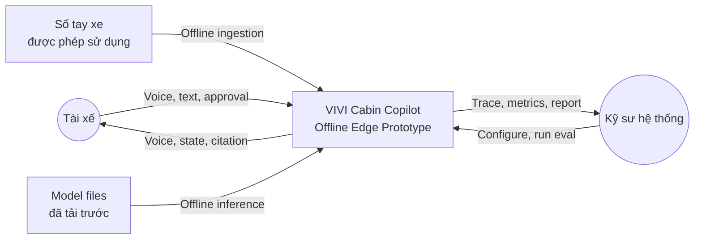
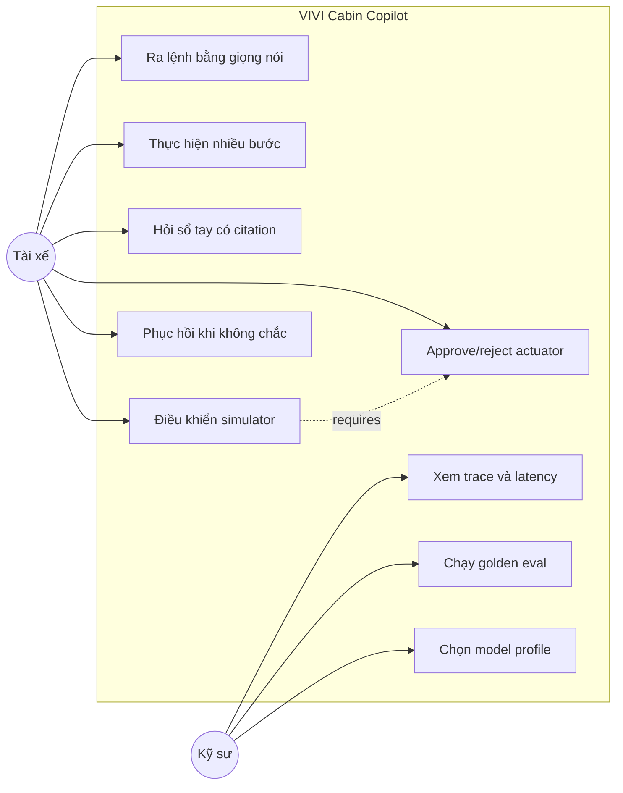
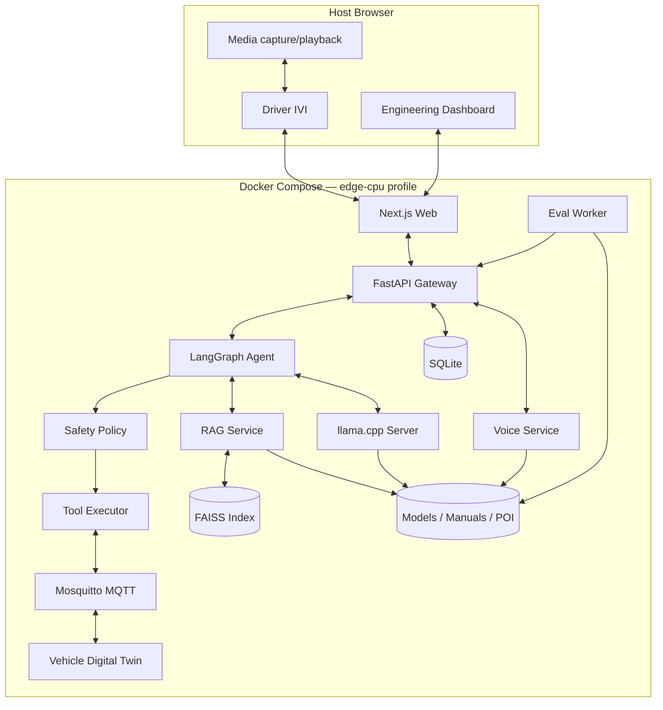
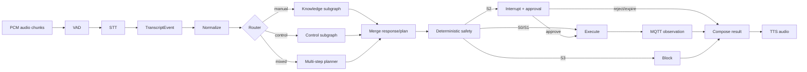
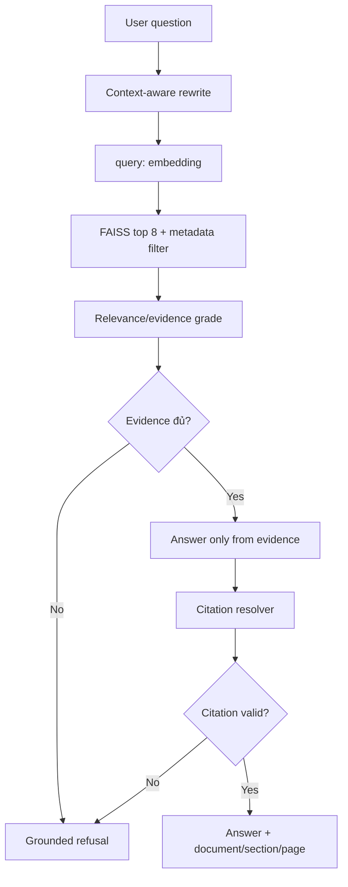
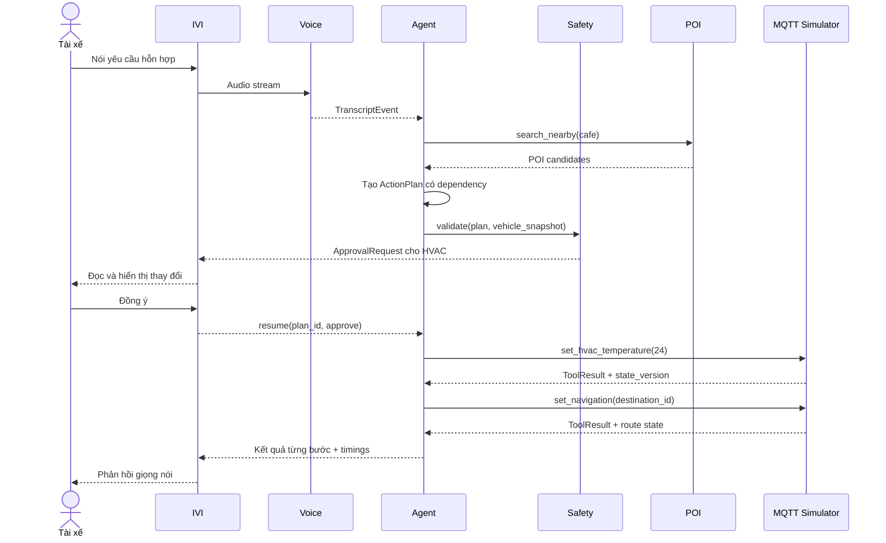
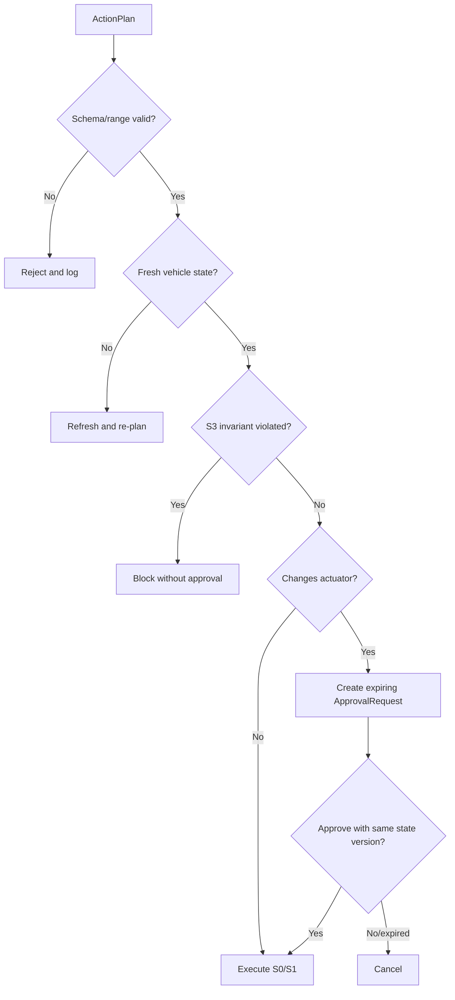
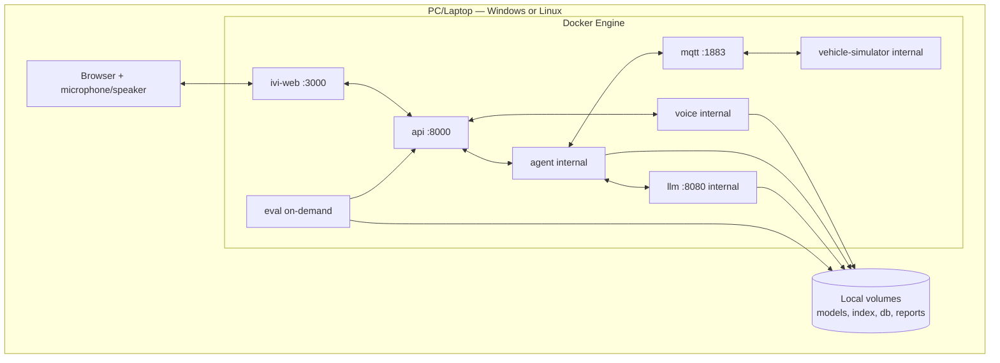

# Architecture Diagrams

## 1. System context

Runtime P0 không có external cloud actor. Việc tải model và tài liệu xảy ra trước offline drill.

## 2. Use case view

## 3. Container/component view

## 4. Voice and agent data flow

## 5. RAG grounded flow

## 6. Multi-step/HITL sequence

## 7. Safety decision flow

## 8. Deployment view

## Component responsibility summary

| Component | Owns | Does not own |
|---|---|---|
| Voice | Audio/STT/TTS và timing | Intent, tool hoặc safety |
| Agent | Routing, plan, RAG orchestration | Quyền cuối cho actuator |
| Safety | Policy, state guard, approval requirement | Natural-language planning |
| Executor | Idempotent tool calls và observations | Chọn tool |
| Simulator | Vehicle invariants và state transition | User intent |
| IVI | Interaction và rendering | Business authorization |
| API | Auth, validation, sessions, event routing | Model reasoning |
| Eval | Measurement và reports | Thay đổi production config tự động |

