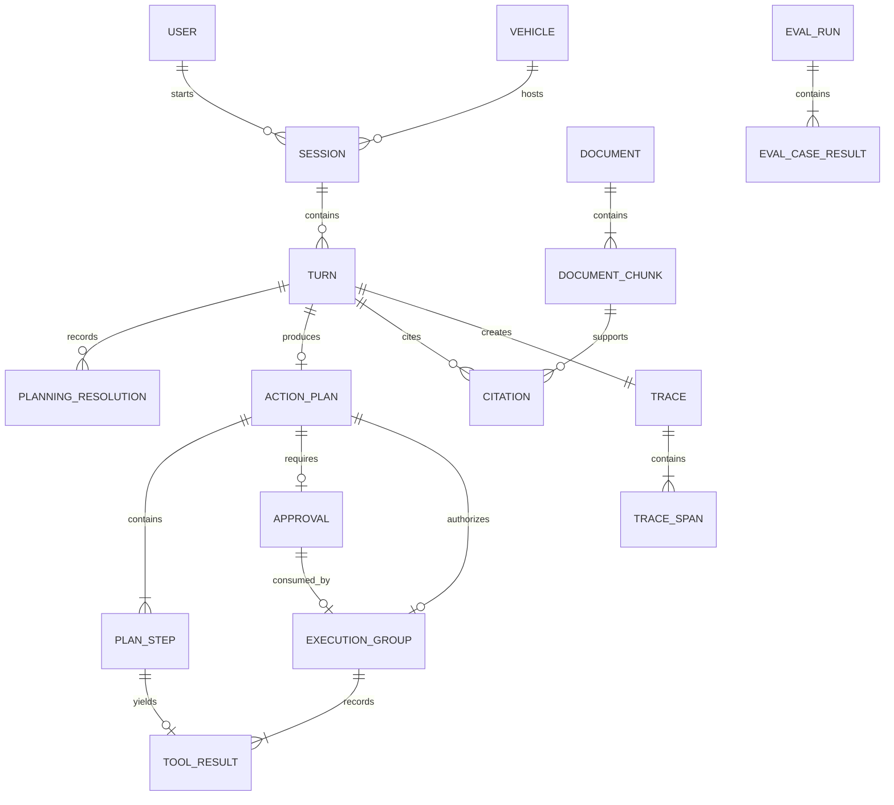

# Data Model and Messaging Specification

## Principles

- SQLite là source of truth cho session/audit; MQTT là event bus mô phỏng, không phải database.
- Mọi entity quan trọng dùng opaque ID có prefix để debug dễ hơn.
- Vehicle state tăng `state_version` sau mỗi transition được chấp nhận.
- Deterministic policy là nguồn phân loại S0–S3; chỉ ActionPlan có S2 mới có ApprovalRequest.
- Model/data/prompt/index version được lưu cùng trace để tái lập eval.
- Raw audio không lưu mặc định.

Safety authority: [Safety and Human-in-the-Loop Specification](safety_and_hitl.md) and [ADR-006](adr/ADR-006-p0-modular-monolith-deterministic-routing-calibrated-hitl.md).

## Entity relationship view



## Relational entities

| Entity | Fields chính | Retention/privacy | Notes |
|---|---|---|---|
| `users` | id, email, password_hash, role, active | Demo lifetime | Seed local; không dùng mật khẩu thật |
| `vehicles` | id, profile_id, display_name, online, state_version | Demo lifetime | Chỉ simulator |
| `sessions` | id, user_id, vehicle_id, status, started_at, ended_at | 30 ngày demo | End session xóa trip memory payload |
| `turns` | id, session_id, input_mode, input_text, confidence, response_text, status | 30 ngày; redact PII | Không chứa raw chain-of-thought |
| `planning_resolutions` | id, turn_id, candidate_step_id, candidate_digest, normalized_lookup_input_json, fixture_version, idempotency_key, status, lease_owner, lease_expires_at, items_json, selected_destination_id, error_summary, started_at, completed_at, created_at, updated_at | 90 ngày demo | Unique `(turn_id, candidate_digest, candidate_step_id, fixture_version)` và unique `idempotency_key`, đều độc lập `plan_id`; exactly-once observable terminal outcome/effectively-once lookup; không phải canonical plan step hay `ToolResult` |
| `action_plans` | id, turn_id, schema_version, status, safety_summary, vehicle_state_version, plan_digest | 90 ngày demo | Immutable ngay sau policy materialization/persistence; `plan_digest = sha256(canonical_json(ActionPlan))`; `requires_approval` chỉ true khi có S2 |
| `plan_steps` | id, plan_id, ordinal, tool, args_json, safety_level, depends_on | 90 ngày demo | Args validated; safety level do deterministic policy gán |
| `approvals` | id, user_id, session_id, plan_id, plan_digest, vehicle_state_version, status, decision, expires_at, decided_at | 90 ngày demo | Immutable server-side binding; partial unique index cho tối đa một row `status='pending'` mỗi session; append-only/single-use và chỉ cho plan có S2 |
| `execution_groups` | id, plan_id, approval_id, approved_vehicle_state_version, authorization_json, status, admitted_at | 90 ngày demo | Một ActionPlan có zero-or-one immutable group, tạo khi atomic admission pass; chỉ cho immutable plan có S2 |
| `tool_results` | id, execution_group_id, step_id, command_id, approval_id, expected_state_version, observed_state_version, attempt_count, status, before_json, after_json, error_code, latency_ms | 90 ngày demo | Terminal record duy nhất: group ID nullable chỉ với S0/S1-only plan; mọi step của admitted mixed S1/S2 plan dùng cùng group ID |
| `documents` | id, title, vehicle_profile, edition, checksum, license_note, source | Theo dataset | Chỉ tài liệu được phép dùng |
| `document_chunks` | id, document_id, section_path, page, text, checksum, vector_key | Theo index version | Text tối thiểu cần thiết |
| `citations` | id, turn_id, chunk_id, excerpt, retrieval_score | 90 ngày demo | Excerpt giới hạn độ dài |
| `traces` | id, session_id, turn_id, status, versions_json | 90 ngày demo | Trace summary |
| `trace_spans` | id, trace_id, component, event, start_ns, end_ns, status, attributes_json | 30 ngày | Redact input nhạy cảm |
| `model_profiles` | id, runtime, model_path_ref, quantization, context, threads, checksum | Demo lifetime | Không lưu external token |
| `eval_runs` | id, suite_id, profile_id, versions_json, status, started_at, ended_at | Giữ làm evidence | Immutable result manifest |
| `eval_case_results` | run_id, case_id, metrics_json, pass, trace_id | Giữ làm evidence | Link tới trace |
| `routines` | id, user_id, name, name_normalized, icon, enabled, steps_json, is_default_template, template_origin, version, previewed_version, created_at, updated_at | Demo lifetime | Epic #270, implement ở #282. `user_id` là FK thật tới `users(id)`; unique `(user_id, name_normalized)` và partial unique `(user_id, template_origin) WHERE template_origin IS NOT NULL`. `steps_json` giữ **nguyên dạng camelCase** của `frontend/.../routines/types.ts` — đó là dạng `src/agents/routines.py` nhận, lưu dạng khác là dịch hai lần |
| `routine_executions` | id, routine_id, user_id, session_id, vehicle_id, routine_version, status, current_index, approval_id, steps_json, results_json, terminal_reason, created_at, updated_at | Demo lifetime | Một lần chạy Routine (#286). `steps_json` là **bản chụp lúc admit**, không phải con trỏ vào `routines`: Done-when của #286 cấm replay plan cũ, và người dùng sửa Routine giữa lúc nó chạy thì lần chạy này vẫn là bản họ đã đồng ý. Partial unique `(session_id) WHERE status IN ('running','waiting_approval')` — tối đa một Routine đang chạy mỗi phiên |
| `user_places` | user_id, label, destination_id, updated_at | Demo lifetime | Đúng hai nhãn `home`/`office` mỗi user (#283). **Vắng hàng = chưa gán**, và không có DEFAULT: `routines_product_spec.md` §Nhà và Cơ quan cấm rơi về địa điểm mặc định |

Required SQLite constraints include `UNIQUE(turn_id, candidate_digest, candidate_step_id, fixture_version)`, `UNIQUE(idempotency_key)`, and partial `UNIQUE(session_id) WHERE status = 'pending'` on `approvals`. For an S2 outcome, immutable `action_plans`/`plan_steps` plus the bound pending `approvals` row are inserted atomically in one DB transaction after all validation/policy. The partial unique check runs inside that transaction; a conflict rolls back both plan and approval, returns `APPROVAL_ALREADY_PENDING`, and creates no plan/group/side effect. S1-only plans keep their direct no-approval persistence/admission flow.

## Agent contracts

`CandidateActionPlan` là internal transient graph contract do [agent_spec.md](agent_spec.md#candidate-to-canonical-plan-boundary) định nghĩa; nó không phải public API hay relational entity, không có safety fields/plan ID, và không được persist như canonical plan. Chỉ deterministic policy sau pure pre-resolution validation, local-POI resolution và common validation mới materialize/persist `ActionPlan` dưới đây.

### PlanningResolution

`PlanningResolution` là persisted audit/idempotency record cho lookup S0 xảy ra trước canonical plan. Candidate không được persist như canonical/executable plan. LangGraph checkpointer có thể persist workflow state, `candidate_digest` và derived step IDs để resume, nhưng bản ghi đó không biến candidate thành `action_plans`/`plan_steps`.

Normalization/deterministic identity chạy theo thứ tự cố định: Unicode NFC; trim/collapse whitespace theo tool schema; materialize defaults; canonicalize numbers; sort object keys; reject additional fields. Backend derive mỗi `candidate_step_id = "cstep_" + prefix(sha256(turn_id + ordinal + tool + canonical_json(normalized_args)))`, rewrite `depends_on` sang derived IDs, rồi tính `candidate_digest = sha256(canonical_json(normalized CandidateActionPlan))`. Cùng turn + ordinal + normalized tool/args tạo cùng step ID và digest khi replay. `normalized_lookup_input_json` lưu closed `search_nearby_poi` args sau normalization cùng server-derived location/profile identifiers, không chứa secret. `fixture_version` pin immutable local fixture. `idempotency_key` độc lập `plan_id`: `turn_id:candidate_digest:candidate_step_id:fixture_version`.

```json
{
  "resolution_id": "pres_01J...",
  "turn_id": "turn_01J...",
  "candidate_step_id": "cstep_7f3a9c21b6e4",
  "candidate_digest": "sha256:...",
  "normalized_lookup_input": {
    "query": "cà phê",
    "category": "cafe",
    "limit": 3,
    "location_ref": "vehicle-demo-01:location-v4",
    "vehicle_profile": "vf-demo-v1"
  },
  "fixture_version": "poi-fixture-2026-07-31-v1",
  "idempotency_key": "turn_01J...:sha256...:cstep_7f3a9c21b6e4:poi-fixture-2026-07-31-v1",
  "status": "succeeded",
  "lease_owner": null,
  "lease_expires_at": null,
  "items": [
    {"destination_id":"poi_cafe_001","name":"Cafe Local","category":"cafe","distance_m":420}
  ],
  "selected_destination_id": "poi_cafe_001",
  "error_summary": null,
  "started_at": "2026-07-31T10:00:01Z",
  "completed_at": "2026-07-31T10:00:01Z",
  "created_at": "2026-07-31T10:00:01Z",
  "updated_at": "2026-07-31T10:00:01Z"
}
```

`status` is exactly `started`, `succeeded`, `empty`, or `failed`; the last three are terminal. One transaction inserts or loads the unique record and acquires a bounded lease by setting `lease_owner`/`lease_expires_at`. A live lease cannot be stolen. A `started` row whose lease expired may be reclaimed; the new owner recomputes only against the already pinned immutable `fixture_version`. The pure fixture read can therefore repeat after a crash, but compare-and-set persists one terminal outcome only once. Concurrent/replayed callers reuse that terminal row. This is **exactly-once observable outcome / effectively-once** behavior, not a claim that physical reads can never repeat.

On `succeeded`, `items` is an array of exact typed objects `{destination_id:string,name:string,category:enum["cafe","restaurant","fuel","parking"],distance_m:integer>=0}` and `selected_destination_id` names one item. `empty` persists `items=[]`, null selection and null error; `failed` persists `items=[]`, null selection and a bounded redacted `error_summary`. All terminal paths clear the lease and set `completed_at`/`updated_at`. Then only the current in-memory candidate is rewritten. `empty`/`failed` returns clarification with no canonical `ActionPlan`, no `ExecutionGroup`, and no side effect. This record is not a `ToolResult`, is never copied into `plan_steps`, and the canonical executor cannot execute or replay it.

### TranscriptEvent

```json
{
  "schema_version": "1.0",
  "session_id": "ses_01J...",
  "turn_id": "turn_01J...",
  "text": "đặt điều hòa 24 độ",
  "language": "vi",
  "confidence": 0.91,
  "speech_end_ns": 817240000000,
  "stt_completed_ns": 817240740000,
  "engine": "whisper-cpp-small",
  "model_checksum": "sha256:..."
}
```

### ActionPlan

```json
{
  "schema_version": "1.0",
  "plan_id": "plan_01J...",
  "session_id": "ses_01J...",
  "vehicle_id": "vehicle-demo-01",
  "vehicle_state_version": 41,
  "steps": [
    {
      "step_id": "step_01J...",
      "ordinal": 1,
      "tool": "set_hvac_temperature",
      "args": {"temperature_c": 24},
      "safety_level": "S1",
      "depends_on": []
    }
  ],
  "requires_approval": false
}
```

### ApprovalRequest

```json
{
  "approval_id": "appr_01J...",
  "plan_id": "plan_01J...",
  "session_id": "ses_01J...",
  "approved_vehicle_state_version": 41,
  "actions": [
    {
      "step_id": "step_01J...",
      "label": "Mở kính trước bên trái 30%",
      "before": {"front_left": 0},
      "after": {"front_left": 30}
    }
  ],
  "expires_at": "2026-08-03T02:00:30Z"
}
```

`ApprovalRequest` public không cần `user_id` hoặc `plan_digest`: server derive user từ authenticated `session_id`, tính digest từ canonical JSON của immutable plan và persist binding `user_id`, `session_id`, `plan_id`, `plan_digest`, `vehicle_state_version` trong `approvals`. `approved_vehicle_state_version` là tên public của snapshot approved đó. Admission re-canonicalize/re-hash và yêu cầu digest bằng binding trước khi consume.

Persisted `approvals.status` is exactly `pending`, `consumed`, `rejected`, `expired`, `invalidated_state`, `invalidated_plan`, or `predicate_failed`. `plan_id` joins to `action_plans.turn_id`, which is the original command turn. A distinct approval-intent turn never changes this row; it only carries the bound identifiers to IVI. The REST decision transaction is the sole **user-decision** writer from `pending`; the deadline/expiry worker is a separate allowed system authority that atomically compare-and-sets `pending→expired` at or after `expires_at`. If REST and expiry race, their transactions serialize: exactly one compare-and-set wins and the loser reads/returns the already terminal state. Expiry emits original-turn `turn.canceled(reason="approval_expired")` and creates no consume, execution group, or MQTT publish.

### ToolResult

```json
{
  "command_id": "cmd_01J...",
  "plan_id": "plan_01J...",
  "step_id": "step_01J...",
  "approval_id": null,
  "execution_group_id": null,
  "expected_state_version": 41,
  "observed_state_version": 42,
  "attempt_count": 1,
  "status": "completed",
  "before": {"temperature_c": 27, "state_version": 41},
  "after": {"temperature_c": 24, "state_version": 42},
  "error_code": null,
  "latency_ms": 38
}
```

## Safety and approval invariants

- `requires_approval=true` iff plan có ít nhất một step S2; S0/S1-only plan không tạo approval.
- Unknown tool, schema invalid hoặc out-of-range là `validation_denied` trước classification; S3 chỉ là valid step bị cấm bởi current vehicle state.
- Plan chứa S3 không bao giờ tới executor.
- `ApprovalRequest` chỉ tồn tại cho plan có S2 và phải liệt kê before/after của tất cả step S2 trước side effect đầu tiên.
- Mỗi session có tối đa một approval `pending`; sensitive request thứ hai bị clarification với `APPROVAL_ALREADY_PENDING`, không tạo plan/approval mới.
- Với S2, immutable ActionPlan và pending ApprovalRequest commit/rollback cùng một transaction; unique conflict rollback cả hai. S1-only không tạo approval và giữ direct flow.
- Với mixed S1/S2 plan, bundled approval hợp lệ là điều kiện trước mọi side effect, kể cả S1.
- `ToolResult.approval_id` nullable cho S0/S1; mọi S2 phải có `approval_id` hợp lệ, matching plan, user/session và state version. `execution_group_id` chỉ nullable cho S0/S1-only plan không tạo group; mọi step, gồm S0/S1, trong admitted mixed S1/S2 plan ghi cùng non-null group ID.
- Approval bind immutable user/session/plan, canonical `plan_digest`, và `vehicle_state_version` (public: `approved_vehicle_state_version`). Ngay trước side effect đầu tiên, atomic admission chỉ pass nếu digest vẫn khớp, actual version bằng approved version và mọi policy condition còn hợp lệ; khi đó approval được consume và tạo immutable `execution_group_id`.
- Voice approval intent là turn riêng và chỉ phát typed `approval.intent.detected` handoff context; chỉ REST `POST /api/v1/approvals/{approval_id}/decision` commit quyết định. Reject/expiry/state invalidation/plan-digest invalidation/predicate failure terminalize original command turn đúng một lần và tạo zero group/MQTT side effect.
- Consumed `execution_group_id` chỉ authorize full immutable plan và tất cả S2 đã approved, không authorize new/edited step. State transition do group tạo không tự invalidate context này.
- Idempotency key là `plan_id:step_id`. Command đầu dùng approved version làm rolling `expected_state_version`; command sau dùng `observed_state_version`/resulting version từ `ToolResult` trước.
- Nếu actual khác rolling `expected_state_version` do external mutation, dừng group; remaining steps là `skipped_external_state_change`, approval không reuse và cần re-plan/re-approve.
- Executor cho phép đúng một retry chỉ cho transient transport failure trước terminal persistence. Cả hai transport attempt dùng cùng `command_id` và `plan_id:step_id`; executor lookup `ToolResult` trước retry, broker/simulator dedupe nên không double transition. Validation failure, policy denial và tool-semantic rejection không retry. Transport retry success persist một result success; retry exhausted persist đúng một terminal failed/timeout rồi P0 fail-fast.
- Sau terminal persistence, replay cùng `plan_id:step_id` trả `ToolResult` đã persist. Attempt mới sau re-plan phải dùng plan/step ID mới.

## Vehicle state

```json
{
  "vehicle_id": "vehicle-demo-01",
  "state_version": 42,
  "observed_at": "2026-08-03T02:00:12Z",
  "motion": {"speed_kph": 0, "gear": "P", "ignition": "ON"},
  "hvac": {"power": true, "temperature_c": 24, "fan_level": 3},
  "windows": {"front_left": 0, "front_right": 0, "rear_left": 0, "rear_right": 0},
  "doors": {"front_left": "closed", "front_right": "closed", "rear_left": "closed", "rear_right": "closed"},
  "media": {"status": "paused", "volume": 35, "track": null},
  "navigation": {"status": "idle", "destination_id": null},
  "seat": {
    "front_left":  {"heating": 0, "fore_aft": 50, "recline": 50, "height": 50},
    "front_right": {"heating": 0, "fore_aft": 50, "recline": 50, "height": 50}
  },
  "lights":     {"headlight": "auto", "interior": false},
  "trunk":      {"position": "closed"}
}
```

Window value là phần trăm mở: `0` đóng hoàn toàn, `100` mở hoàn toàn.

`lights.headlight` là enum chế độ `auto | low_beam | high_beam` — **không có `off`**, xem
[ADR-020](adr/ADR-020-lights-and-trunk-domains.md). `trunk` chỉ có `position`, không có `locked`,
cùng deferral với `doors`.

Domain `seat` tồn tại vì registry có `set_seat_heating` và `set_seat_position` ([agent_spec.md](agent_spec.md#tool-registry-and-planning-invariants)); không có nó thì hai tool đó chạy xong không có chỗ ghi kết quả và không verify được. `heating` là 0..3, ba trục vị trí là 0..100, khớp đúng dải trong registry.

## MQTT topics

| Topic | Publisher | Subscriber | Payload |
|---|---|---|---|
| `v1/vehicles/{id}/commands/{domain}` | Tool executor | Simulator | VehicleCommand |
| `v1/vehicles/{id}/events/command` | Simulator | Agent/API | accepted/rejected/completed |
| `v1/vehicles/{id}/state/{domain}` | Simulator | Agent/API/UI bridge | Domain state + version |
| `v1/vehicles/{id}/state/snapshot` | Simulator | Agent/API | Full snapshot |
| `v1/vehicles/{id}/health` | Simulator | API/dashboard | online, heartbeat, version |

Không cho LLM tạo raw topic. Tool registry ánh xạ tool name sang topic allowlist.

QoS, retain, Birth/LWT, enum `{domain}`, bảng ánh xạ tool→topic, và payload của `events/command`, `state/{domain}`, `health` nằm ở [MQTT Transport Specification](mqtt_spec.md). JSON Schema máy đọc được ở [`schemas/mqtt/`](../schemas/mqtt/).

### VehicleCommand

```json
{
  "schema_version": "1.0",
  "command_id": "cmd_01J...",
  "idempotency_key": "plan_01J...:step_01J...",
  "plan_id": "plan_01J...",
  "step_id": "step_01J...",
  "vehicle_id": "vehicle-demo-01",
  "approval_id": null,
  "execution_group_id": null,
  "expected_state_version": 41,
  "tool": "set_hvac_temperature",
  "args": {"temperature_c": 24},
  "issued_at": "2026-08-03T02:00:11Z"
}
```

Với command thuộc `execution_group_id`, `expected_state_version` là rolling value: command đầu dùng approved version, command tiếp theo dùng `observed_state_version` từ `ToolResult` trước. S2 command phải mang approval/group context matching; sample S1 nên các field đó là `null`.

## RAG artifacts

### Public Citation

Canonical/public Citation is a joined projection over `citations`, `document_chunks`, and `documents`; every field below is required and additional fields are rejected in schema version 1.0:

```json
{
  "citation_id": "cit_01J...",
  "turn_id": "turn_01J...",
  "document_title": "Demo vehicle manual",
  "section": "Tyre-pressure warning",
  "page": 112,
  "chunk_id": "chunk_manual_001_112_03",
  "excerpt": "…",
  "retrieval_score": 0.86
}
```

`chunk_id` must resolve to the cited document/version and support the bounded `excerpt`; the API never accepts a client filesystem path as a citation identifier.

| Artifact | Contents | Version key |
|---|---|---|
| Manual manifest | document, edition, checksum, license/source note | `manual_manifest_version` |
| Chunk store | text + section/page/checksum | `chunker_version` |
| FAISS index | vectors keyed by chunk id | `index_checksum` |
| Embedding config | model checksum, dimensions, normalization, prefixes | `embedding_version` |

`multilingual-e5-small` yêu cầu `query:` và `passage:` prefixes cho retrieval bất đối xứng; config phải ghi rõ để tránh regression do ingestion/query khác nhau.

## Retention and deletion

| Data | Default | Deletion trigger |
|---|---:|---|
| Raw audio | Không lưu | Buffer giải phóng sau turn |
| Transcript/response | 30 ngày demo | User delete hoặc cleanup job |
| Trip memory | Trong session | Session end |
| Trace spans | 30 ngày | Cleanup job |
| Approval/tool audit | 90 ngày demo | Project cleanup |
| Eval evidence | Giữ theo release | Superseded release vẫn giữ manifest |

## Data quality checks

- Checksum không đổi giữa chunk store và index manifest.
- Citation page/section phải resolve tới chunk tồn tại.
- Duplicate command id không tạo state transition thứ hai.
- State version tăng đúng một lần cho mỗi accepted transition.
- Eval case không chứa đường dẫn tuyệt đối phụ thuộc máy.
- Manual profile/edition phải khớp vehicle profile của session.
