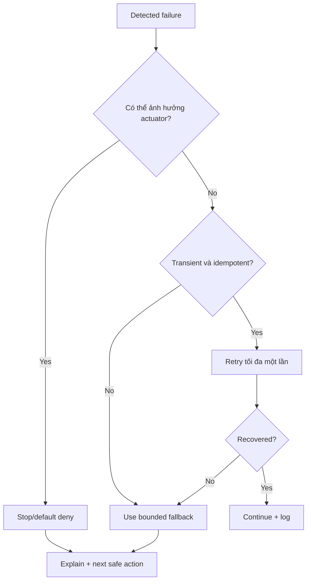

# Failure Modes and Recovery

## Nguyên tắc

- Fail closed cho actuator; fail explicit cho người dùng.
- Không nói success nếu thiếu observed ToolResult.
- Retry chỉ cho lỗi transient và phải bounded/idempotent.
- Mỗi failure mode có detection, fallback, owner và eval case.

## Failure mode library

| ID | Trigger | Hậu quả | Detection signal | Mitigation | User fallback | Owner | Eval case |
|---|---|---|---|---|---|---|---|
| F01 | Mic permission/device lỗi | Không có audio | Browser media error | Preflight device check | Text input | Voice | ASR-019 |
| F02 | Cabin noise/STT confidence thấp | Sai intent/target | Confidence/entropy, transcript mismatch | VAD tuning, phrase hints, bake-off | Đọc lại và hỏi một câu | Voice | ASR-001..020 |
| F03 | Câu lệnh mơ hồ | Sai actuator/side | Missing required slot, top-2 intent sát | Required-field gate | Tối đa hai lựa chọn | Agent | NLU-016 |
| F04 | LLM output sai schema | Không có plan hợp lệ | JSON Schema validation | Một repair attempt | Deterministic matcher/help | Agent | ADV-004 |
| F05 | Planner tạo dependency cycle | Deadlock/thứ tự sai | DAG validator | Reject plan | Xin nói lại/tách yêu cầu | Agent | PLAN-021 |
| F06 | Manual retrieval không liên quan | Hallucination | Recall/score/coverage thấp | Metadata filter + grade | Grounded refusal | RAG | RAG-031 |
| F07 | Manual chứa prompt injection | Tool/prompt bị chi phối | Injection marker/test case | Treat document as data; tool disabled | Refuse unsupported instruction | RAG/Safety | ADV-001 |
| F08 | Citation không resolve | Mất niềm tin | Citation resolver fail | Validate trước response | Không trả claim kỹ thuật | RAG | RAG-034 |
| F09 | Vehicle state/plan digest/predicate đổi trước admission | Action không còn hợp lệ | Typed approval invalidation code | Cancel original turn exactly once; zero consume/group/MQTT | Giải thích và tạo plan/approval mới | Safety | SAFE-006 |
| F10 | Approval timeout/replay/reject | Thực thi không còn hợp lệ | Expiry/consumed/decision flag | Single-use + 30s expiry + typed terminal reason | Yêu cầu lại khi phù hợp | Safety | SAFE-004 |
| F11 | Door/seat command khi xe chạy | Unsafe transition | Motion/gear invariant | Policy + simulator double-check | Từ chối và giải thích | Safety | SAFE-001 |
| F12 | MQTT broker down | Không điều khiển được | Health check, publish timeout | One reconnect/retry | Báo không thể điều khiển | Vehicle | SAFE-015 |
| F13 | Duplicate delivery | Thực thi hai lần | Existing idempotency key | Deduplicate in simulator | Hiển thị result gốc | Vehicle | SAFE-009 |
| F14 | Partial multi-step failure | User hiểu sai kết quả | Mixed ToolResult statuses | Per-step persistence | Nêu rõ step thành công/thất bại | Agent/Vehicle | PLAN-023 |
| F15 | LLM timeout/CPU overload | Latency cao | Deadline/span timeout | Warm-up, context cap, resource profile | Workflow fallback/text response | Edge | PLAN-025 |
| F16 | TTS model lỗi | Không có audio response | Synthesis error/no first chunk | Pre-warm, sanitize text | Text + short error tone | Voice | ASR-020 |
| F17 | WebSocket disconnect | UI/state lệch | Heartbeat/reconnect event | One reconnect + rehydrate | Chuyển text hoặc restart session | Platform | CTRL-029 |
| F18 | SQLite/log disk full | Mất audit | Write error/disk threshold | Rotation, reserve, health warning | Chặn actuator nếu không ghi approval/audit | Platform/Safety | SAFE-018 |
| F19 | Model/index version đổi giữa session | Không tái lập được | Version mismatch | Pin profile/index per session | Kết thúc/restart session | Platform | ADV-008 |
| F20 | Network dependency vô tình được gọi | Offline demo fail/privacy risk | Egress monitor/DNS failure | Offline profile, vendored artifacts | Local fallback hoặc explicit unavailable | DevOps | ADV-010 |
| F21 | Session đã có pending approval hoặc voice approval intent mơ hồ | Hai authorization cạnh tranh hoặc commit nhầm | Partial unique conflict / intent ambiguity | Tối đa một pending; intent event chỉ handoff, IVI commit qua REST | `APPROVAL_ALREADY_PENDING` clarification hoặc nói lại; zero side effect | Platform/Safety | SAFE-019 |
| F22 | Resolver crash khi `PlanningResolution` đang `started` | Lookup bị treo/lặp | Lease expiry | Reclaim lease against pinned fixture; compare-and-set one terminal outcome | Clarification nếu terminal `empty/failed` | Agent | PLAN-024 |

## Error routing

## Trust recovery

- Cho người dùng thấy transcript đã nghe.
- Nêu step nào đã/không thực hiện.
- Mở citation hoặc trace summary phù hợp vai trò.
- Cho phép cancel, nói lại hoặc chuyển text.
- Không đổ lỗi cho người dùng hoặc dùng câu “AI đôi khi sai” thay cho thông tin cụ thể.

## Operational ownership

| Domain | Primary | Secondary |
|---|---|---|
| Voice/audio | Thành viên 1 | Thành viên 2 |
| Agent/RAG | Thành viên 2 | Thành viên 3 |
| Safety/MQTT | Thành viên 3 | Thành viên 4 |
| UI/API/DevOps | Thành viên 4 | Thành viên 1 |

Release blocker được owner xử lý nhưng reviewer chéo xác nhận fix và regression evidence.
