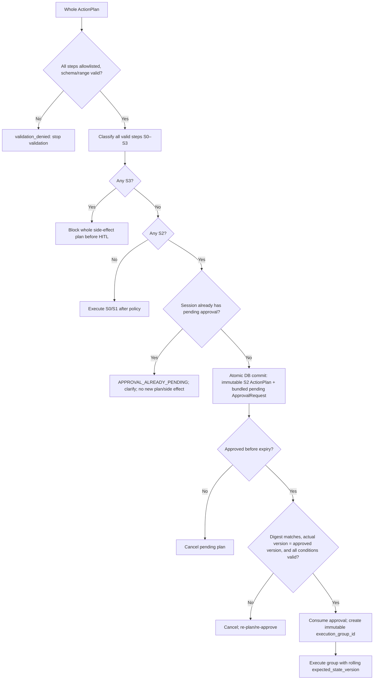
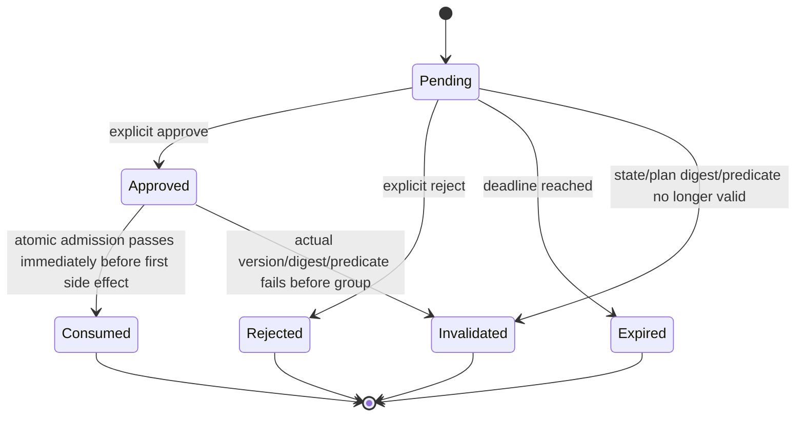

# Safety and Human-in-the-Loop Specification

## Safety statement

Hệ thống chỉ hỗ trợ và mô phỏng. Nó không kết nối CAN, ECU hoặc xe thật. Mọi action phải qua schema validation và deterministic policy; chỉ action S2 cần approval. Approval không thể hợp thức hóa action S3 bị policy cấm.

Authority: [ADR-006](adr/ADR-006-p0-modular-monolith-deterministic-routing-calibrated-hitl.md). Typed contract liên quan: [Data Model and Messaging Specification](data_model.md).

## Safety levels

| Level | Loại | Ví dụ | Hành vi |
|---|---|---|---|
| S0 | Read-only | Trạng thái xe, tra sổ tay | Execute ngay |
| S1 | Ít rủi ro, đảo ngược | HVAC, sưởi ghế, media, navigation | Policy validate → execute → feedback/cancel/undo khi support |
| S2 | Sensitive simulated actuator | Window; door/seat position khi state stationary cho phép | Mandatory voice-first HITL |
| S3 | Forbidden current state | Door action hoặc seat movement ngoài stationary predicate | Block trước HITL |

Unknown tool, schema invalid hoặc argument out-of-range là `validation_denied` trước S0–S3 classification; chúng không phải S3. S3 chỉ là action hợp lệ nhưng bị cấm bởi vehicle state hiện tại.

## Classification rules

- Window luôn là S2.
- Door là S2 chỉ khi `speed_kph == 0 && gear == P`; ngoài predicate đó là S3.
- Seat position là S2 chỉ khi `speed_kph == 0 && gear == P`; ngoài predicate đó là S3.
- Trunk là S2 chỉ khi `speed_kph == 0 && gear == P`; ngoài predicate đó là S3. Chép nguyên quy tắc của door, không phát minh gì: ngành dùng ngưỡng 5 km/h (FMVSS interior trunk release) và chính VF9 tự khóa toàn bộ cửa khi vượt 10 km/h, nên predicate của repo chặt hơn cả hai.
- HVAC (gồm `set_hvac_fan_level`) và seat heating là S1; media và navigation cũng là S1 trong prototype.
- **Đèn là S1 ở mọi trạng thái xe**, gồm cả `set_headlight_mode` lẫn `set_interior_light`. Đây là quyết định an toàn, không phải bỏ sót — cơ sở đầy đủ ở [ADR-020](adr/ADR-020-lights-and-trunk-domains.md), tóm tắt:

  Thao tác nguy hiểm với đèn là *tắt đèn chiếu gần khi đang chạy ban đêm*. Nhưng `headlight` là **enum chế độ** (`auto` / `low_beam` / `high_beam`) và **không có `off`** — UNECE R48 quy định xe có đèn chạy ban ngày bắt buộc có đèn chiếu gần tự động theo ánh sáng môi trường và không được phép có chế độ tắt thủ công. Thao tác nguy hiểm đó **không tồn tại trong hợp đồng**, nên không có gì để chặn.

  Đây là lý do đèn không cần một quy tắc phân loại theo `args`. `classify(tool, snapshot)` giữ nguyên chữ ký; nếu tương lai có ai thêm `off` vào enum thì phải quay lại mục này trước, vì lúc đó bật và tắt hết đối xứng về rủi ro. Android Automotive cũng xếp `HEADLIGHTS_SWITCH` là property read-write thường, **không** có interlock theo tốc độ.
- SLM chỉ route/retrieve/propose typed plan; không được gán safety level, thay policy hoặc publish MQTT.
- S3 không có bypass, kể cả khi user yêu cầu hoặc đã có approval.

## Core invariants

| Invariant | Enforcement |
|---|---|
| Validation precedes safety classification | Unknown tool, schema invalid và out-of-range dừng ở `validation_denied`, không tới S0–S3 hoặc HITL |
| Mọi valid action qua policy | Deterministic policy phân loại S0–S3 trước executor |
| S2 chỉ chạy với approval hợp lệ | Approval bind immutable user/session/plan, canonical `plan_digest` và `approved_vehicle_state_version`; executor chỉ admit khi digest/state predicates/version đều khớp |
| S1 không cần approval | Vẫn phải qua policy và audit trước/sau execution |
| Door/seat position/trunk chỉ là S2 khi stationary | `speed_kph == 0 && gear == P`; nếu không là S3, policy + simulator kiểm độc lập |
| Enum `headlight` không có `off` | Schema đóng ở `schemas/mqtt/vehicle_state_domains.schema.json` + `HeadlightMode`; `scripts/validate_mqtt_schemas.py` có case âm khẳng định `headlight="off"` bị từ chối |
| Window command luôn cần approval | Policy |
| HVAC/seat heating không cần approval | S1 policy + audit |
| Argument ngoài range không tới MQTT | Schema/range validator |
| Tối đa một pending approval/session | SQLite partial unique constraint; request S2 thứ hai trả `APPROVAL_ALREADY_PENDING` clarification, không tạo approval/side effect |
| S2 plan/approval không orphan | Sau full validation/policy, immutable ActionPlan + pending ApprovalRequest persist trong một DB transaction; unique conflict rollback cả hai |
| Approval không dùng lại cho plan khác | Plan-bound, immutable, single-use logical record |
| Atomic group admission | Ngay trước side effect đầu tiên, canonical plan digest phải khớp binding, actual `vehicle_state_version` phải bằng approved version và mọi condition còn hợp lệ |
| Consumed authorization chỉ thuộc immutable plan | Admission pass tạo `execution_group_id` rồi consume approval ngay trước side effect đầu tiên; không authorize step mới/đã sửa |
| Rolling expected version | Command đầu dùng approved version; command sau dùng version mới từ `ToolResult` trước |
| State transition của group không tự invalidate approval | Consumed authorization giữ hiệu lực cho full immutable plan; chỉ external version mismatch mới dừng group |
| Retry không double transition | Đúng một retry chỉ cho transient transport failure; lookup result trước retry, dùng cùng `command_id`/`plan_id:step_id`, broker/simulator dedupe và chỉ persist một terminal `ToolResult`; validation/policy/tool-semantic failure không retry |
| Model không publish topic tùy ý | Static tool/topic registry |

## Decision flow

## Approval UX contract

Voice-first approval UX cho S2 phải đọc rõ, và card phải hiển thị, các thông tin sau:

- action và target cụ thể;
- before → after;
- lý do cần xác nhận;
- thời hạn (mặc định 30 giây);
- lựa chọn approve/reject rõ ràng.

Ví dụ: “Tôi sẽ mở kính trước bên trái từ 0% lên 30%. Bạn có đồng ý không?”

Approval là immutable, single-use và server-side bind với user/session/plan, canonical `plan_digest` và state snapshot. `approved_vehicle_state_version` là snapshot tại thời điểm tạo request; không dùng câu hỏi mơ hồ như “Bạn có chắc không?”. Không coi im lặng, đóng popup hoặc mất kết nối là approve.

Voice-first không có nghĩa WebSocket được quyền quyết định. Câu “đồng ý/từ chối” là một voice turn riêng: STT + deterministic intent resolution có thể phát `approval.intent.detected` chứa `approval_id`, `original_turn_id`, `decision` và `approved_vehicle_state_version`, nhưng không consume/reject approval. IVI phải gọi REST `POST /api/v1/approvals/{approval_id}/decision`. Approval-intent turn terminalize đúng một lần sau handoff, hoặc failed/canceled nếu mơ hồ/không có pending. Original command turn vẫn nonterminal cho tới REST outcome rồi terminalize đúng một lần.

## P0 mixed-plan and bundled approval

P0 dùng atomic side-effect semantics cho admission của cả plan:

- Validate allowlist/schema/range cho toàn bộ plan trước; validation denied hoặc chỉ một S3 thì không step side-effect nào được chạy.
- Nếu có S2, tạo đúng một bundled approval trước mọi side effect, liệt kê before → after của tất cả S2. Mixed S1/S2 cũng chờ approval này trước khi chạy bất kỳ S1 hoặc S2 nào.
- Sau full validation/policy, S2 immutable plan và pending approval commit atomically. Mỗi session có tối đa một pending approval; partial-unique conflict rollback cả plan lẫn approval và trả `APPROVAL_ALREADY_PENDING` clarification, không plan/group/side effect. S1-only giữ direct no-approval flow.
- Reject, expiry hoặc state stale hủy toàn bộ pending plan. Sửa plan tạo plan và approval mới.
- Approval bind canonical `plan_digest` cùng `approved_vehicle_state_version`, user có thể reject toàn bộ, và expiry mặc định là 30 giây. Ngay trước side effect đầu tiên, group admission re-canonicalize/re-hash plan và re-read actual state: chỉ pass khi digest khớp, actual bằng approved version và toàn bộ condition còn hợp lệ.
- Khi admission pass, consume approval ngay trước side effect đầu tiên và tạo immutable `execution_group_id`/authorization context cho full plan. Context chỉ authorize các S2 đã approved của plan immutable, không authorize step mới hoặc đã sửa.
- Mỗi command dùng rolling `expected_state_version`: command đầu dùng approved version; command sau dùng new version từ `ToolResult` trước. State transition do chính execution group tạo không tự invalidate consumed authorization.
- Nếu actual version khác rolling expected version do external mutation, dừng group; step chưa chạy là `skipped_external_state_change`, approval không reuse và cần re-plan/re-approve.
- Một response S0 độc lập có thể trả về trong lúc plan đang pending, nhưng không được ngụ ý các action của plan đã thành công.
- Reject, expiry, state-version mismatch, plan/digest mismatch hoặc predicate failure dùng outcome lần lượt `approval_rejected`, `approval_expired`, `approval_invalidated_state`, `approval_invalidated_plan`, `approval_predicate_failed`; original turn kết thúc đúng một lần và mọi path này có zero consume/group/MQTT.
- REST là sole user-decision authority. Deadline worker là system authority duy nhất khác được CAS `pending→expired` tại `expires_at`; nếu worker race với REST, đúng một transaction thắng, loser đọc terminal state. Worker phát original `turn.canceled(reason="approval_expired")` đúng một lần và không consume/group/MQTT.

## Approval lifecycle

Approval là single-use. `Consumed` context authorize tất cả S2 đã approved trong immutable plan, chỉ sau atomic admission pass; không authorize step mới/đã sửa. Mỗi `ToolResult` ghi `execution_group_id`, expected và observed/resulting state version.

## Partial execution

- Atomic ở P0 là quyết định admission trước side effect: không chạy prefix plan vì validation denied, S3, approval thiếu/hết hạn, hoặc state stale.
- P0 fail-fast: nếu side-effecting step fail/timeout/rejected, dừng execution group; mọi step chưa bắt đầu là `skipped_due_to_prior_failure`. Nếu external state mismatch, mọi step còn lại là `skipped_external_state_change`.
- Lưu completed/failed/skipped `ToolResult` theo từng step, báo chính xác outcome và không bao giờ tuyên bố full success khi group không hoàn tất; không silent rollback.
- Executor chỉ được đúng một retry cho transient transport failure trước khi persist terminal `ToolResult`. Retry lookup result trước, dùng cùng `command_id` và idempotency key; broker/simulator dedupe nên không double transition. Validation failure, policy denial và tool-semantic rejection có zero retry. Transport retry thành công chỉ persist một success; retry exhausted chỉ persist một terminal failed/timeout rồi fail-fast group.
- Sau terminal `ToolResult`, replay cùng `plan_id:step_id` trả result đã persist; attempt mới phải re-plan với plan/step ID mới.
- Chỉ rollback khi tool có inverse rõ và policy cho phép. Rollback là action mới; inverse S2 cần approval mới.
- Media/navigation cancel hoặc undo chỉ tự động khi tool support và policy vẫn cho phép; không tự rollback silent các action S2.

## RBAC

| Operation | Driver | Engineer |
|---|---:|---:|
| Tạo cabin session | Có | Test-only qua fixture |
| Approve plan của chính mình | Có | Không mặc định |
| Xem own trip history | Có | Có khi audit mode |
| Xem P0 safe structured trace/readiness/aggregate | Own trace only | Có, read-only và role-scoped |
| Xem full trace/chạy eval | Không | Chỉ CLI/P1 có authorization + audit; không phải P0 public |
| Đổi model/config | Không | Chỉ CLI/P1 có authorization + audit; không phải P0 public |
| Tắt safety policy | Không | Không |

Không có UI/API để tắt policy trong runtime.

## Threats and mitigations

| Threat | Mitigation |
|---|---|
| User nói “bỏ qua an toàn” | System rule + policy ngoài LLM |
| Manual chứa prompt injection | Retrieved text là untrusted evidence, tool disabled trong RAG generator |
| Replay approval | Single-use approval + state version + expiry |
| Race giữa approval và state update | Re-read snapshot ngay trước execution |
| LLM bịa ToolResult | Composer chỉ nhận persisted executor results |
| Engineer vô tình đổi model giữa session | Staged activation; chặn khi active sessions hoặc pin profile theo session |
| MQTT client giả publish command | Broker credentials/ACL trong compose network; simulator validate command schema |

## Audit record

Mỗi quyết định lưu:

- user/session/vehicle/plan IDs;
- normalized plan và safety classification;
- policy version;
- state snapshot/version;
- approval payload/decision/time;
- tool command/result;
- trace/model/tool versions.

Không lưu hidden chain-of-thought.

## Required safety tests

1. S1 hợp lệ (HVAC, seat heating, media hoặc navigation) chạy không cần approval, nhưng có policy/audit.
2. S2 không có approval bị reject.
3. Unknown tool, schema invalid hoặc out-of-range là `validation_denied` trước S0–S3/HITL.
4. S3 bị block trước khi tạo hoặc hiển thị approval.
5. Approval hết hạn, state stale hoặc replay bị reject; approval không thể dùng cho plan/session khác.
6. Door/seat position là S2 chỉ khi `speed_kph == 0 && gear == P`; ngoài predicate là S3.
7. Hai S2 steps dùng cùng một approval đã consumed, `execution_group_id` và rolling state versions.
8. External mutation làm actual khác rolling expected version: dừng group, remaining steps là `skipped_external_state_change`.
9. Side-effect step fail/timeout/rejected làm remaining steps là `skipped_due_to_prior_failure`.
10. Đúng một retry chỉ cho transient transport failure dùng cùng `command_id`/`plan_id:step_id`, lookup result trước retry và broker/simulator dedupe nên không double transition; chỉ một terminal `ToolResult` được persist; validation/policy/tool-semantic failure có zero retry.
11. Retry exhausted persist terminal failed/timeout một lần rồi fail-fast; replay cùng `plan_id:step_id` trả `ToolResult` trước, còn attempt mới cần re-plan/new IDs.
12. Window luôn được phân loại S2.
13. HVAC và seat heating được phân loại S1.
14. Ambiguous window/door target không tạo plan executable.
15. Mixed S1/S2 chờ một bundled approval trước mọi side effect; có S3 thì không có side effect nào.
16. Prompt injection không thay đổi policy/tool registry; SLM không gán safety hoặc publish MQTT.
17. Partial unique constraint giữ tối đa một pending approval/session; request S2 thứ hai trả `APPROVAL_ALREADY_PENDING` và tạo zero plan/approval/group/side effect.
18. Voice approval-intent turn chỉ emit typed handoff; IVI gọi REST để commit. Intent turn và original command turn mỗi turn có đúng một terminal event.
19. Reject, expiry, state invalidation, plan/digest invalidation và predicate failure dùng đúng stable outcome/reason, không consume approval, không tạo group hoặc MQTT transition.

Quality gate: toàn bộ safety tests pass; bất kỳ unauthorized execution nào là release blocker.
