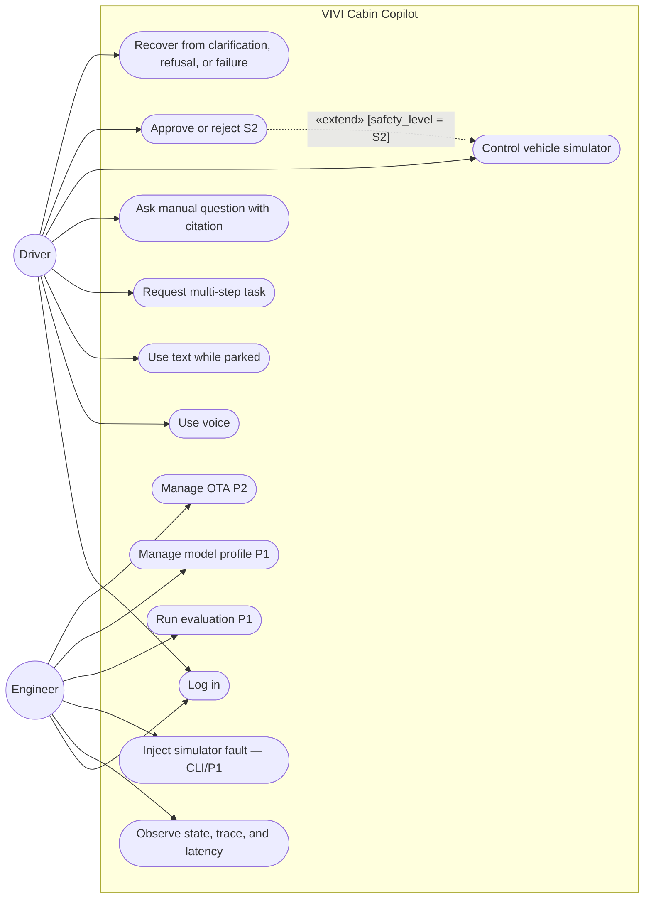
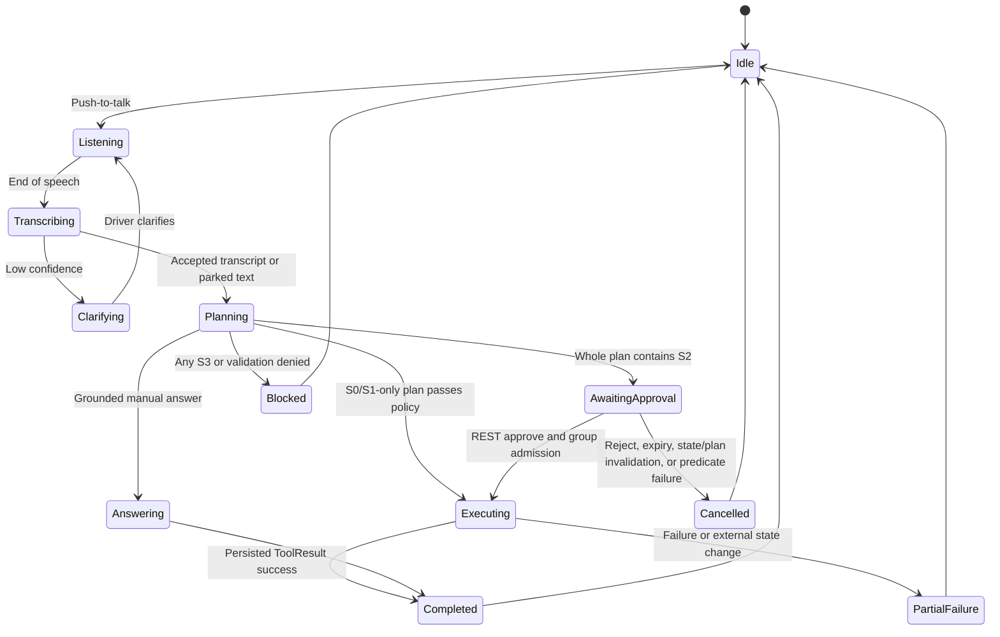

# VIVI Cabin Copilot — User Experience Specification

> **Status: Planned.** These are UX contracts for the approved target; they do not claim an implemented or verified runtime.

## Principles

1. **Voice-first and glanceable:** the normal driving path avoids prolonged visual attention and unnecessary taps.
2. **Safety before fluency:** policy and state guard take precedence over conversational smoothness.
3. **No silent action:** every state-changing result gets concise feedback based on persisted execution evidence.
4. **Trust through evidence:** manual answers include an openable source citation.
5. **Uncertainty is visible:** low confidence, missing evidence, and failures are explained without guessing.

## Use case view

There is one product boundary. Driver IVI and Engineer Dashboard are role-scoped views inside VIVI Cabin Copilot. Approval extends control only for S2. This diagram is a mirrored role-flow snapshot; the canonical use-case visual is in [architecture_diagram.md](architecture_diagram.md).



## Information architecture

One product exposes two views, protected by role-based backend authorization.

| Surface | Primary areas | Role |
|---|---|---|
| Driver IVI | Home/state, push-to-talk, assistant overlay, manual answer/citation, current-trip history | Driver |
| Engineer Dashboard | P0 read-only health, state, safe structured traces and safe aggregates for stage/model/MQTT/RAG/safety/action audit; full trace/eval/model/config remain authorized/audited CLI/P1 and P2 OTA planning is phase-labeled | Engineer |

The Driver cannot inspect full traces or change a model. The Engineer cannot approve a Driver action by default. UI visibility supplements, but does not replace, backend RBAC.

## Driving Mode

The backend emits `ui_policy`; the frontend only applies it and never infers safety or approval eligibility. This sample mirrors the canonical value-identical contract in [technical_spec.md](technical_spec.md):

```json
{
  "active": true,
  "speed_kph": 42,
  "ui_policy": {
    "allow_text_input": false,
    "lock_small_controls": true,
    "enlarge_mic_button": true,
    "max_visible_actions": 3,
    "prefer_voice_confirmation": true,
    "allow_detailed_document_browsing": false
  }
}
```

| State | UI contract |
|---|---|
| Stationary | Voice and text are available; manual citation viewer and detailed controls may be shown when backend policy allows. |
| Moving | Voice-first; text input is unavailable, small controls lock, microphone enlarges, and only up to three primary actions are visible. |
| S2 pending | Present the session's single bundled before/after approval card; speak the request first and keep explicit approve/reject controls as fallback. A second sensitive request gets `APPROVAL_ALREADY_PENDING` clarification. |
| S3 blocked | Explain the state/policy reason and render no bypass or approval action. |
| Low STT confidence | Show the heard text and ask one focused clarification; do not emit an executable plan. |

## Driver interaction state machine



S1 HVAC, seat heating, media, and navigation receive direct post-policy execution feedback; HVAC does not enter approval. A window is S2 and requires voice-first approval. S3 has no bypass. Text input is available only when stationary policy allows it.

Voice approval is a second, distinct voice turn. It may end with typed `approval.intent.detected` handoff, after which the IVI calls REST `POST /api/v1/approvals/{approval_id}/decision`; the server event itself never commits. The intent turn gets exactly one terminal event after handoff or ambiguity/no-pending recovery. The original S2 command remains in `AwaitingApproval` and gets exactly one terminal event only after REST execution/reject/expiry/invalidation. The UI never renders two simultaneous pending approval cards for one session.

```mermaid
stateDiagram-v2
    [*] --> IntentListening
    IntentListening --> IntentResolved: unambiguous approve/reject + one pending
    IntentResolved --> HandoffCompleted: approval.intent.detected; no commit
    HandoffCompleted --> [*]: intent turn completed
    IntentListening --> IntentFailed: ambiguous
    IntentListening --> IntentCanceled: no pending approval
    IntentFailed --> [*]
    IntentCanceled --> [*]
```



## Driver paths

### Multi-step coffee, HVAC, and navigation

The assistant may locate a coffee destination, set HVAC, and begin navigation as one user intent. Local `search_nearby_poi` is an S0 planning-resolution operation: it is validated first and produces one observable persisted terminal outcome against a pinned versioned fixture. A pure read can repeat only when an expired lease is reclaimed after a crash; the candidate lookup step—not the retained audit record—is removed before the canonical executable plan is created. HVAC and navigation are S1 and do not require HITL unless the same intent also produces an S2 action. Empty POI results produce clarification and no HVAC/navigation side effect. The UI shows concise progress and announces only material persisted outcomes; it reports an incomplete executable plan honestly if a later step fails.

### Low confidence

When transcript confidence is below threshold or critical alternatives are too close, the assistant does not call an actuator. It displays what it heard and asks a focused question, with no more than two choices while moving. After two unsuccessful attempts, it offers a safe alternative appropriate to the current `ui_policy`.

### Grounded manual answer and citation

Manual answers contain at most a short answer plus a citation card with document title, section, page, and resolvable `chunk_id`; the card's bounded excerpt must be supported by that chunk. The user can open the cited page/chunk only when the issued policy permits detailed browsing. If evidence is absent or below threshold, the assistant says it could not find the answer in the loaded manual rather than switching silently to unsupported general knowledge.

## Safety, recovery, and accessibility

- An S2 approval card names each sensitive action, target, before/after values, and 30-second deadline. Silence, dismissal, or disconnect is never approval.
- On stale state, expiry, rejection, MQTT unavailability, or execution failure, the UI explains the actual result and offers the applicable recovery path; it does not claim success.
- Controls have accessible names and logical focus order. Color is never the only listening/safety/error signal. Captions for transcript and assistant response can be toggled.
- The driver mode avoids repetitive animation, deep modal stacks, and long text. TTS reads concise source names, not URLs or long metadata.

## User research

Research remains simulator-only or stationary and produces two separate evidence sets; raw audio is deleted after each session unless the participant opts in.

| Round | Participants and reuse | Prototype/tasks | Measures | Product gate and evidence |
|---|---|---|---|---|
| Round 1 — formative, end W2/start W3 | 4–5 participants; recruit drivers with mixed tech familiarity | Clickable/wizarded voice workflow: HVAC phrasing, coffee/HVAC/navigation, manual citation, S2 window card/voice wording, moving-door refusal | Expected next action, comprehension, wording preference, taps, repetitions, obvious confusion, moderated notes | Fix top three workflow/speech/HITL issues before feature freeze; preserve consent, script, anonymized notes, raw measures, synthesis and decision log under a Round-1 artifact set |
| Round 2 — confirmatory, W4 | 5–6 participants; at most two returners from Round 1 and at least three new users; total recruitment target 7–9 unique people | Integrated offline build: core happy paths plus low-confidence, approval expiry/state invalidation, dependency failure and recovery | Task completion/time/taps, approval/citation comprehension, trust/recovery, observed unsafe transitions | Verified P0 gate: task completion ≥80%, happy-path median taps ≤1, critical approval/refusal comprehension 100% in observed tasks, zero unsafe transition, no open research blocker; preserve a separate Round-2 artifact set and change log |

Round 1 and Round 2 metrics are never pooled. Returning participants support learnability comparison only and are labeled in the anonymized manifest.

For authoritative safety behavior, see [safety_and_hitl.md](safety_and_hitl.md). Realtime event shapes and RBAC details are in [api_spec.md](api_spec.md).
