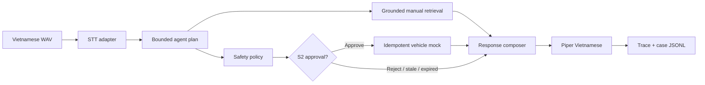

# VIVI Cabin Copilot — Offline AI PoC

This package is the reproducible feasibility harness for `SPIKE-001`. It keeps
voice processing, agent orchestration, safety/tool execution, RAG and reporting
behind separate adapters so the team can benchmark or replace each workstream
without rewriting the whole pipeline.

## Current evidence status

| Area | Harness/tests | Real artifact benchmark |
|---|---:|---:|
| Typed config, plans and dataset | Ready | N/A |
| llama.cpp-compatible client | Ready | 0.5B/3B Q4 complete; both fail current gates |
| STT/PhoWhisper adapter and WER/CER | Ready | 30 synthetic WAV complete; real speakers pending |
| Piper adapter | Ready | 30-prompt latency/RAM run complete |
| Grounded manual retrieval/citations | Ready | Lexical PoC baseline ready; E5/FAISS comparison pending |
| LangGraph HITL and vehicle mock | Ready | Interactive control E2E complete |
| Interactive E2E control/RAG | Ready | Qwen 3B control completed; grounded RAG completed |
| Stage trace, scoring and immutable report | Ready | Benchmark + interactive E2E run directories + summary report |

The approved recording workflow is documented in the [SPIKE-001 Offline PoC Video Kit](../../docs/video/offline-poc-evidence/README.md); the linked MP4 remains pending until recording and review are complete.

Passing unit tests are not model-quality or latency evidence. ADR-005 is now
`Not Yet`: both required Qwen profiles have raw runs, but neither passes the
schema/tool/latency gates. Hai single-case interactive E2E demo đã chạy local;
network-disabled 30-case acceptance remains open.

## Vertical slice



## Local setup

From the repository root on Windows PowerShell:

```powershell
.\.venv\Scripts\python.exe -m pip install -e ".\experiments\offline_poc"
Set-Location .\experiments\offline_poc
& '..\..\.venv\Scripts\python.exe' -m pytest -q
& '..\..\.venv\Scripts\python.exe' -m offline_poc.runner validate
```

Expected fixture validation: three candidate profiles, two required profiles
and exactly 30 evaluation cases.

## Model acquisition

`scripts/download_models.ps1` downloads exactly one profile per invocation,
pins the Hugging Face revision and writes `.sha256` plus `.metadata.json` next
to the GGUF. It never downloads all profiles by default.

```powershell
# Preview only; no network download
.\scripts\download_models.ps1 -Profile qwen25-05b-q4 -DryRun

# After installing the `hf` CLI and obtaining approval for large downloads
.\scripts\download_models.ps1 -Profile qwen25-05b-q4
.\scripts\download_models.ps1 -Profile qwen25-3b-q4
```

Required artifacts are the official Qwen GGUF repositories pinned in the
script. Qwen 0.5B is Apache-2.0; Qwen 3B uses the Qwen Research license, so the
team must review its terms before redistribution. Q8 is optional and must run
only after both Q4 candidates produce valid evidence.

## Commands

```text
python -m offline_poc.runner validate
./scripts/run_llm_profile.ps1 -Profile qwen25-05b-q4
./scripts/run_llm_profile.ps1 -Profile qwen25-3b-q4
python -m offline_poc.runner tts --profile piper-vais1000-medium
python -m offline_poc.runner stt --profile phowhisper-small --audio-manifest <path>
python -m offline_poc.runner cases --profile <id> --all
python -m offline_poc.runner e2e --profile <id> --audio-path <path-to-wav>
python -m offline_poc.report --root ../../eval/results/spike-001 --write-summary ../../eval/results/report.md
```

`llm`, `stt`, `tts` và interactive `e2e` được bật cho pinned local artifacts.
Chạy E2E qua wrapper để llama-server được quản lý và HITL đọc quyết định sau
LangGraph interrupt:

```powershell
.\scripts\run_e2e_demo.ps1 -Profile qwen25-3b-q4 -AudioPath <path-to-wav>
```

`cases` vẫn fail closed và E2E hiện chỉ là single-case interactive demo; không
được trình bày như network-disabled 30-case acceptance hoặc p50/p95 benchmark.

## Evidence contract

Each immutable run directory under `eval/results/spike-001/<UTC-run-id>/`
contains:

- `manifest.json`: environment, sources, revisions, licenses and checksums;
- `case_results.jsonl`: one flushed raw row and trace ID per case;
- `metrics.json`: raw metrics plus hard-gate/ranking result;
- optional run-specific notes; the cross-run generated decision is
  `eval/results/report.md`;
- an internal demo-video link when available (currently pending).

Hard gates are applied before ranking. Any cloud call, schema miss, safety
violation, duplicate actuator execution, invalid citation, RAM miss or E2E
latency miss makes the candidate ineligible even if its weighted score is high.

## Voice data policy

The formal TTS run writes a reproducible synthetic audio manifest beside its
WAV files. Synthetic audio proves pipeline integration only and must not be
presented as representative human-speaker WER. Real recordings require explicit
consent and a new manifest scope. See `eval/datasets/poc/v1/audio/README.md`.

## Measured checkpoint

The generated source of truth is `eval/results/report.md`. Current highlights:

- Qwen2.5-0.5B Q4: schema 55%, tool exact 15%, p50 3.86 s, peak 598.9 MiB.
- Qwen2.5-3B Q4: schema 70%, tool exact 30%, p50 11.19 s, peak 2,088.1 MiB.
- PhoWhisper-small on Piper synthetic: warm p50 6.98 s, WER 30.7%, peak 1,602.9 MiB.
- Piper fresh-process mode: p50 2.12 s, process-tree peak 227.6 MiB.

Both LLM candidates fail the current hard gates; Q8 was intentionally not
downloaded because precision is not the limiting factor demonstrated by these
runs.

## Upstream references

- Qwen GGUF model pages: <https://huggingface.co/Qwen/Qwen2.5-0.5B-Instruct-GGUF>
  and <https://huggingface.co/Qwen/Qwen2.5-3B-Instruct-GGUF>
- PhoWhisper-small: <https://huggingface.co/vinai/PhoWhisper-small>
- llama.cpp releases: <https://github.com/ggml-org/llama.cpp/releases>
- Piper Vietnamese voice: <https://huggingface.co/rhasspy/piper-voices/tree/main/vi/vi_VN/vais1000/medium>

## Safety boundary

This is a simulator-only engineering PoC. It does not connect to a production
CAN bus and is not evidence of automotive safety certification. Physical-action
tools remain behind HITL, stale/expired approvals fail closed, and moving-vehicle
door opening is blocked before execution.
